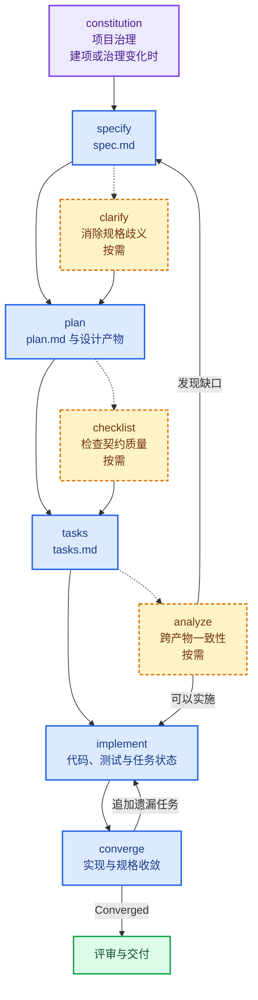

> 法者，天下之程式也，万事之仪表也
>
> ——《管子·明法解》

## 01. 为什么还要先写规格

使用 AI Agent 写代码时，最诱人的方式是直接描述需求，然后让它开始修改文件。对于一个按钮、一处样式或边界明确的缺陷，这样做通常没有问题。但需求一旦跨越多个模块，Agent 很容易一边理解需求，一边临时决定架构，最后交付出一套“代码能够运行，行为却和预期有偏差”的实现。

我在立项 [SubTandem](https://github.com/janwee-sha/SubTandem) 时就引入了 Spec Kit。这个为 IINA 提供实时双语字幕的插件，看起来只是“读取字幕、调用翻译服务、显示译文”，实际却同时涉及播放器窗口隔离、异步任务失效、OpenAI Chat Completions 兼容协议与 Ollama 协议、凭据存储、Swift helper、TypeScript 插件、安装包和实机验收。任何一个边界没有提前说清，最后都可能表现为译文写入错误窗口、跳转后显示过期结果，甚至把凭据带进日志。

[GitHub Spec Kit](https://github.com/github/spec-kit) 提供了一套开箱即用的 Spec-Driven Development（SDD）脚手架，把“从想法到代码”拆成一组职责清楚的阶段，并使用 Markdown 产物在阶段之间传递已经确认的意图。按照[官方对 SDD 的解释](https://github.github.com/spec-kit/concepts/sdd.html)，规格不再是写完就丢弃的前置文档，而是能够继续驱动计划、任务与实现的契约。

在 SubTandem 的实践中，Spec Kit 明显减少了不同阶段反复猜测“用户到底想要什么”的情况。规格先定义“做什么、为什么做”，计划再决定“怎么做”，任务负责把方案变成可执行顺序，实现阶段则尽量不再临场发明产品需求。

不过，SDD 也不是所有改动的固定仪式。SubTandem 后来在项目协议中采用了轻重双轨：新增用户能力、跨运行时变更、安全与持久化边界变更使用完整 SDD；局部文档修正、依赖维护和边界清楚的小缺陷则使用简短说明、直接实现和相称的验证。流程的意义是降低不确定性，而不是让每次改动都生成同样多的文件。

## 02. 安装 Specify CLI

Spec Kit 的命令行工具名为 `specify`。它负责把模板、脚本和 Agent 集成安装到项目中，真正阅读需求、生成产物和实现代码的仍是你选择的 AI Agent。

官方推荐使用 `uv` 安装。安装 `uv` 后执行：

```bash
uv tool install specify-cli
specify version
```

上面的命令会安装当前稳定版本。如果希望团队和 CI 重现完全相同的脚手架，可以固定 GitHub Release。本文对应的版本为 `v1.0.1`：

```bash
uv tool install specify-cli \
  --from git+https://github.com/github/spec-kit.git@v1.0.1
```

对于一个尚未创建的新项目，可以让 `specify` 建立项目目录，并为 Codex 安装 skills 形式的命令：

```bash
specify init subtandem \
  --integration codex \
  --integration-options="--skills"
cd subtandem
```

> [!NOTE]
> 将命令中的 `subtandem` 替换为你的项目目录名称。

本文以 2026 年 8 月发布的 Spec Kit 1.0.1 和 Codex skills 集成为例，所以下文使用 `$speckit-specify` 这类调用形式。其他 Agent 通常使用 `/speckit.specify`；入口名称不同，读取的模板和生成的 SDD 产物一致。

如果代码仓库已经存在，则不需要先把整个系统倒推成规格。先提交或暂存当前改动，建立一个可以审查的基线，再从仓库根目录初始化：

```bash
specify init --here --force \
  --integration codex \
  --integration-options="--skills"
```

`--here` 表示使用当前目录，`--force` 允许向非空目录合并脚手架文件。它不会重写业务代码，但可能刷新与 Spec Kit 冲突的受管文件，因此在已有项目中执行后一定要查看 `git diff`。[官方的既有项目接入指南](https://github.github.com/spec-kit/guides/existing-projects.html)也建议从下一项边界明确的变更开始使用，而不是把“为全部旧代码补规格”当作第一项任务。

以 Codex skills 模式初始化后，核心目录大致如下：

```text
.
├── .agents/skills/          # Codex 可调用的 speckit skills
├── .specify/
│   ├── memory/              # 项目宪法
│   ├── scripts/             # 各阶段使用的辅助脚本
│   └── templates/           # spec、plan、tasks 等模板
└── specs/                   # 每项功能的 SDD 产物
```

`specify init` 通常只需执行一次。以后打开项目时，Agent 会直接读取已经安装的 skills 和 `.specify` 目录，不需要每次重新初始化。

### 2.1. 更新 CLI 和项目脚手架

CLI 与项目中的 skills、模板和脚本是两层内容。只更新 CLI，并不会自动重写已经提交到仓库中的脚手架。可以先只读检查版本，再预览和执行升级：

```bash
specify self check
specify self upgrade --dry-run
specify self upgrade
```

随后进入项目，检查并升级 Codex 集成：

```bash
specify integration status
specify integration upgrade codex
specify extension update
```

SubTandem 最近一次升级就是从 0.15.2 更新到 1.0.1。除了版本字段，升级还刷新了多个 skill、Shell 脚本和模板，并将活动规格指针 `.specify/feature.json` 调整为本机状态，不再纳入版本控制。这样的改动不应被当作一个黑盒命令直接接受；我会先让 `specify integration status` 确认受管文件没有本地修改，升级后再检查 diff 和运行项目验证。更复杂的升级场景可以参考[官方 Upgrade Guide](https://github.github.com/spec-kit/upgrade.html)。

## 03. 先看完整工作流

Spec Kit 1.0.1 的完整 SDD 主线如下。紫色的 `constitution` 是项目级治理步骤，只在建项或规则变化时执行；蓝色节点组成每项功能的主线，黄色虚线框表示按风险加入的可选质量门，绿色节点表示可以进入评审与交付。`implement` 与 `converge` 会循环，直到实现与契约收敛。



这不是一条只能向前的流水线。`clarify` 发现范围不清时会修改规格；`checklist` 发现契约缺失时应返回 `specify` 或 `clarify`；`analyze` 发现设计与需求冲突时应回到真正拥有该信息的文件修正。越早发生这种返工，代价越低。

下面以 SubTandem 的第一项规格——[实时字幕翻译 MVP](https://github.com/janwee-sha/SubTandem/tree/main/specs/001-realtime-subtitle-translation)——贯穿每一个阶段。

## 04. Constitution：定义不可随功能漂移的规则

宪法描述的是整个项目都必须遵守的原则，而不是某一项功能的需求。它的目标是给后续所有阶段提供稳定的判断依据：某个技术方案即使能实现功能，只要违反项目宪法，也不能进入任务列表。

在 Codex 中可以这样建立第一版宪法：

```text
$speckit-constitution

SubTandem 必须保证翻译延迟或失败不会阻塞原始播放；
每个播放器窗口的异步状态必须隔离；凭据不得返回 UI、日志或诊断信息；
发布包必须能够从版本控制中的源码和锁文件重建，产品变更必须包含相称的验证。
```

默认产物是 `.specify/memory/constitution.md`。后续 `plan`、`tasks` 和 `analyze` 会在运行时读取它，因此宪法不是只在项目开始时看一次的宣言。SubTandem 后来把 `docs/engineering/constitution.md` 设为唯一权威来源，而 `.specify/memory/constitution.md` 只保留导航，避免两份治理规则逐渐不一致。

一条有用的宪法原则应当能够对方案产生约束。例如“凭据不得进入 UI 状态”可以否决把 API key 存入普通 preferences 的设计；“异步结果只作用于所属会话”会要求计划定义足够的身份与失效检查。相反，“代码应当优雅”“用户体验应当良好”很难直接判定，只会在每个阶段消耗上下文。

宪法也会随着经验演进。SubTandem 在实际使用中加入了轻重双轨、中文优先且职责单一的文档、明确的并行文件所有权、控制人工验收成本等原则。这些规则不是一次提示词里凭空生成的，而是把已经验证有价值的项目经验固化下来，并通过版本号记录治理变化。

## 05. Specify：先把“做什么”写成可验收的契约

`specify` 的输入应该描述用户、行为、目标和边界，不要急着指定框架、模块和类。SubTandem 最初的输入非常接近一句产品描述：

```text
$speckit-specify

为 IINA 提供按播放位置实时翻译外部文本字幕的双语字幕插件。
翻译延迟或失败不得暂停视频，用户只允许将当前位置附近的必要字幕
发送给自己明确选择的兼容 OpenAI Chat Completions API 的服务或 Ollama 服务。
```

命令会创建类似 `specs/001-realtime-subtitle-translation/` 的功能目录，把它记录为当前活动规格，并生成 `spec.md`。其中最重要的内容不是一段更长的需求描述，而是可以独立验收的用户故事、Given/When/Then 场景、功能需求、边界情况、范围外事项、假设和可量化成功标准。

SubTandem 的 P1 用户故事是“观看实时双语字幕”。它进一步规定：原字幕保持可见，译文按原时间轴出现，翻译失败不得阻塞播放，两个播放器窗口之间不得串状态。P2 才讨论有限前瞻和会话缓存，P3 再处理翻译服务 Profile。这样排序后，即使后面的管理能力尚未完成，前面的故事仍能独立测试，而不是只能等整个项目一次性交付。

规格阶段还要主动写清不做什么。当时 MVP 只处理可访问的外部 SRT/ASS，不做音频转写、图像型字幕、整片预翻译、持久译文缓存和云同步。后来 SubTandem 对内嵌字幕和独立 Overlay 的支持分别成为新的有界规格，而不是悄悄扩大第一项任务。这种切片方式既保护上下文，也让每次实现都有清楚的验收终点。

### 5.1. Clarify：在设计前消灭高影响歧义

自然语言规格几乎不可能一次写完整。`clarify` 会针对当前 `spec.md` 提出少量高影响问题，并把确认后的答案写回规格，而不是另外生成一份容易失效的问答记录：

```text
$speckit-clarify

聚焦字幕来源、跳转后的旧请求、多窗口隔离、缓存生命周期和凭据边界。
```

对 SubTandem 而言，“实时”究竟代表当前一句、固定秒数还是整部视频，“失败不影响播放”是否也包含重试和迟到结果，“切换服务”对已有缓存与在途请求有什么影响，都会实质改变后面的架构。如果这些问题留到实现阶段，Agent 往往会采用最容易编码的默认答案，而且不同模块可能采用不同答案。

`clarify` 的目标不是把每个细节都问一遍，而是在进入技术设计前消除会改变范围、验收或架构的未知项。如果后面的 `analyze` 又发现需求缺口，仍然可以返回这一阶段。由 `specify` 建立的 `checklists/requirements.md` 也会随规格澄清重新评估，它表示内置的规格完整性检查，不等同于代码测试已经通过。

## 06. Plan：把产品契约映射为技术方案

当规格已经能够回答“什么结果算完成”，才进入 `plan`。这个阶段可以提供技术栈、现有架构和必须沿用的工程约束：

```text
$speckit-plan

使用 IINA 插件的 TypeScript main/global 运行时和 Sidebar WebView；
每个播放器 main entry 独立持有播放会话，global 只共享 Profile 元数据；
IINA 原生 HTTP 能力不足的部分由受限 Swift helper 提供；
使用 Vitest、Swift tests 和正式安装包实机验收。
```

主要产物是 `plan.md`。它要说明技术上下文、架构边界、项目结构、验证方法以及宪法检查。SubTandem 的规格要求两个窗口互不影响，计划便把播放器的 epoch、请求、缓存、重试和字幕显示都归给各自的 main entry；规格要求凭据不回到 UI，计划便让 global 充当 broker，并将固定用途的本地存储交给 Swift helper。这就是规格与计划之间应有的可追溯关系。

复杂功能还会产生几类辅助设计产物。`research.md` 保存经过比较的技术决策与理由，例如为什么不能只依赖 IINA 自带 HTTP；`data-model.md` 定义 Profile、播放会话、翻译批次和缓存项的状态；`quickstart.md` 把自动化与实机验收组织成可重复步骤；`contracts/` 则精确描述 provider 输出、helper RPC 和 Sidebar/Main/Global 消息边界。

在 AI 协作中，`contracts/` 往往比一段架构概述更重要。SubTandem 的 provider contract 明确规定结果必须使用请求中的 ID，重复、未知、缺失或空结果不得缓存；消息 contract 规定凭据只能单向写入，不能从 Global 返回 Main 或 Sidebar；异步结果落地前必须重新核对播放器、会话、窗口、Profile revision 和批次身份。不同 Agent 即使分别实现 provider、UI 和 helper，也能依据同一份边界工作。

计划不是越长越好。研究理由、数据状态、协议和验证已经由其他文件负责时，`plan.md` 应通过链接关联它们，不要重复抄写。重复上下文不仅浪费 token，还会在需求变化后制造多个互相冲突的“权威版本”。

## 07. Checklist：给自然语言契约做单元测试

`checklist` 检查的不是代码是否工作，而是需求是否足够完整、清晰、一致。官方把它称为“requirements 的单元测试”，这个比喻很准确：

```text
$speckit-checklist

重点检查隐私披露、凭据生命周期、多窗口并发、失败回退和实机验收。
```

生成的自定义清单通常位于功能目录的 `checklists/` 中。比如规格写了“安全保存凭据”，清单应继续追问保存位置、读取方向、删除语义、日志边界和用户披露是否都已定义；规格写了“多窗口隔离”，清单则应检查跳转、关闭、切换 Profile 和迟到结果是否都有对应行为。

这里有一个容易混淆的地方：`specify` 维护的内置 `requirements.md` 用于基本规格质量检查，而 `checklist` 生成的领域清单由评审者负责。`[x]` 只表示评审者确认该项需求质量达标，不表示相关代码已经实现。Agent 可以协助检查，但不应在没有评审的情况下自行生成问题、再自行宣布全部通过。

如果清单暴露出缺口，应回到拥有该信息的阶段修正：产品行为缺失就修改或澄清 `spec.md`，技术边界缺失就完善计划与契约。不要把答案直接写进清单，因为清单是质量门，不是新的需求来源。

## 08. Tasks：把设计变成可交付的执行顺序

`tasks` 会读取规格和全部可用设计产物，生成依赖有序的 `tasks.md`：

```text
$speckit-tasks
```

任务通常先处理项目准备和所有用户故事共享的基础能力，再按 P1、P2、P3 的顺序为每个用户故事建立阶段，最后处理跨领域收尾工作。每条任务应带有明确的文件路径和完成动作，并能追溯到用户故事；测试也应放在对应故事的阶段内，而不是形成一个无法说明保护了什么行为的“最后补测试”阶段。

`[P]` 表示任务看起来可以并行，但它不是启动多个子 Agent 的充分条件。SubTandem 的剩余实机验收中，有些测试在执行层面互不依赖，却会修改同一份证据文件，因此文档写入仍然必须串行。真实的并行任务除了没有数据依赖，还应拥有不重叠的文件，并明确使用哪份契约、运行什么验证以及什么状态才算完成。

如果团队习惯用 GitHub Issues 跟踪执行，可以在审查 `tasks.md` 后调用 `$speckit-taskstoissues`。它只是把已有任务转成外部跟踪单元，不负责改善任务质量，因此不应在任务列表尚未稳定时提前执行。

### 8.1. Analyze：实施前检查三类核心产物

`analyze` 对 `spec.md`、`plan.md` 和 `tasks.md` 做只读的一致性检查：

```text
$speckit-analyze
```

它会报告没有任务覆盖的需求、找不到需求来源的任务、互相冲突的描述、违反宪法的设计和不可判定的验收标准，但不会直接修改文件。这一点很重要：发现问题后，应回到来源修正，而不是让分析报告成为第四套事实。

我倾向于在一个新的会话中执行分析。编写规格和计划的 Agent 很容易沿用自己之前的假设，新的上下文则更接近独立评审者。只要 SDD 产物本身足够完整，新会话不需要重放此前的聊天记录，也能判断“需求—设计—任务”是否连通。

## 09. Implement 与 Converge：实现不是流程终点

完成规格、计划、清单和一致性审查后，才进入代码实现：

```text
$speckit-implement
```

`implement` 会先读取清单状态，再按 `tasks.md` 的依赖顺序工作。小功能可以一次完成；SubTandem 这样的功能更适合按阶段调用，明确要求本轮只实现基础设施或某一个用户故事，完成代码与测试后先验证，再开启下一轮：

```text
$speckit-implement

只实现 User Story 1 及其自动化测试，完成验证后停止，
不要提前实现 Profile 管理和后续故事。
```

分阶段实现能够把源码、测试输出和诊断信息留在当前上下文，而不是让 Agent 同时背着整份产品历史。任务完成标记也必须和真实验收一致；代码写完但构建、测试或必要的实机步骤未完成时，任务仍不能假装闭环。

Spec Kit 1.0.1 在主流程中还提供了 `converge`：

```text
$speckit-converge
```

它在实现后重新对照规格、计划和任务检查代码库。如果已经满足契约，就报告 `Converged`，且不修改 `tasks.md`；如果发现遗漏，只会在 `tasks.md` 末尾追加收敛任务。随后再次执行 `implement`，再运行 `converge`，直到不再存在缺口。

这补上了早期流程中容易被忽略的一环。Den Delimarsky 在 2025 年的 [What's The Deal With GitHub Spec Kit](https://den.dev/blog/github-spec-kit/) 中展示的工作流以 `implement` 收尾，而当前版本明确把“代码已经生成”和“实现满足契约”区分开。测试通过只能证明已有测试没有失败，`converge` 要追问的是规格中是否还有根本没有进入测试和代码的行为。

## 10. 用独立会话管理上下文

Spec Kit 的每个阶段都可以放在独立会话中执行。我的做法是：当前阶段完成后先查看产物 diff，确认没有待澄清项，再关闭会话；下一阶段让 Agent 重新读取宪法、当前功能目录和必要的代码。这样会话只保留解决当前问题所需的内容，而已经批准的决定由版本化文件承接。

独立会话并不是为了让 Agent 忘记项目，而是为了区分两种上下文。聊天记录包含试探、被否决的方案和临时解释；SDD 产物只应描述当前认可的意图。让下一阶段读取后者，可以减少旧假设的锚定，也避免对话变长后源码和测试输出被挤出上下文窗口。

Spec Kit 1.0.1 使用 `.specify/feature.json` 记录当前活动规格，并默认将它作为本机状态忽略。它与 Git 分支是两个不同维度：切换分支不会自动改变活动规格。如果同一仓库存在多个 `specs/NNN-feature`，执行命令前应核对活动目录，必要时更新该文件或设置 `SPECIFY_FEATURE_DIRECTORY`。否则一段非常完整的上下文，也可能被写进错误的规格目录。

## 11. 子 Agent 要按契约协作

SDD 很适合子 Agent 协作，因为 `research.md`、`contracts/` 和 `tasks.md` 已经提供了比一句“帮我实现这个模块”更稳定的交接材料。但并行数量不是目标，减少关键路径才是。

在计划阶段，可以让不同子 Agent 分别调查 IINA 运行时限制、provider 协议或 Swift helper 可行性，再由主 Agent 将结论收敛进 `research.md` 和 `plan.md`。在实现阶段，只有真实独立的切片才适合并行：例如一个 Agent 负责 provider adapter，另一个负责不共享文件的 native contract tests。共享消息类型、入口文件和构建配置是热点，应由单一负责人修改，或者事先规定合并顺序。

一次可执行的委派至少要说明以下内容：

```text
范围：实现哪个任务和用户故事
契约：必须遵守哪些 spec、data model 或 contracts
文件：允许修改哪些文件，哪些共享文件禁止修改
验证：必须运行哪些命令
完成：什么结果可以交回主 Agent
```

如果这些信息无法写清，说明任务拆分还没有达到可以并行的质量。先修正计划或任务，比让多个 Agent 在同一批文件上互相覆盖更省时间。需要同时修改独立功能时，还应使用隔离 worktree，让工作区和提交边界真正分开。

## 12. SDD 的核心仍是契约质量

Spec Kit 能快速生成整套目录，但文件齐全不代表 SDD 做得好。真正有用的规格需要让不同的人或 Agent 对“是否满足”得出相同结论。

“翻译应该足够快”不是一个可靠契约；“服务在 3 秒内返回有效批次时，首条译文在播放开始后 5 秒内准备完成”才可以验证。“正确处理响应”也不够；SubTandem 明确要求请求 ID 唯一对应，重复、未知、缺失和空结果不得缓存，测试才能覆盖每一种失败。“注意保护凭据”更无法指导跨运行时实现；规定凭据只能沿保存和使用所需的单向路径流动，Main 与 Sidebar 只能拿到 configured/not-configured 状态，才形成了清楚的所有权边界。

契约还要控制自身规模。`spec.md` 负责产品意图，`plan.md` 负责技术方案，`contracts/` 负责接口，`tasks.md` 负责仍要执行的工作，Git 历史和 Release Notes 才负责记录过去。把同一段要求复制到每个文件，会让 Agent 获得更多文字，却得到更差的上下文。

因此，我现在更愿意把 Spec Kit 称为 SDD 脚手架，而不是自动开发工具。它已经准备好了模板、命令、阶段关系和质量门，但最终契约是否明确、是否及时返工、是否值得执行完整流程，仍由开发者决定。

第一次使用时，可以选择一项边界明确、但确实存在若干设计取舍的功能，依次执行：

```text
$speckit-constitution
$speckit-specify
$speckit-clarify
$speckit-plan
$speckit-checklist
$speckit-tasks
$speckit-analyze
$speckit-implement
$speckit-converge
```

走完之后，最值得复盘的不是 Agent 写了多少代码，而是每个阶段是否都把不确定性变成了下一阶段可以直接使用的契约。只要这条传递链成立，换一个会话、换一个 Agent，甚至隔一段时间再回来，项目意图仍然能够继续被执行。

## 引用

1. SubTandem 源码仓库：[janwee-sha/SubTandem](https://github.com/janwee-sha/SubTandem)
2. GitHub Spec Kit 源码仓库：[github/spec-kit](https://github.com/github/spec-kit)
3. Den Delimarsky：[What's The Deal With GitHub Spec Kit](https://den.dev/blog/github-spec-kit/)
