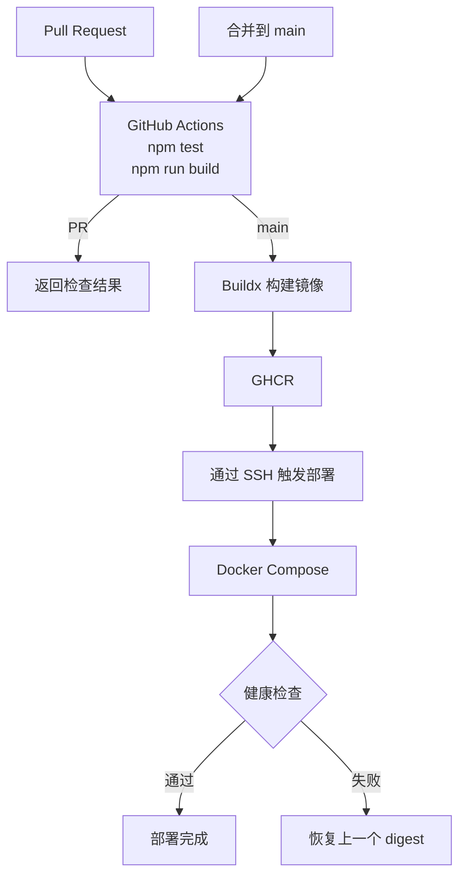

> 凡事豫则立，不豫则废
>
> ——《礼记·中庸》

## 01. 目标与流程

持续集成（Continuous Integration，CI）的重点是尽早验证变更，持续交付或部署（Continuous Delivery/Deployment，CD）则负责把通过验证的产物送到目标环境。本文将使用 GitHub Actions、GitHub Container Registry（GHCR）和 Docker Compose 搭建一条完整管道：

1. Pull Request 指向 `main` 时安装锁定依赖，执行单元测试和生产构建。
2. 代码合并到 `main` 后再次通过验证，再构建 Docker 镜像并推送到 GHCR。
3. GitHub Actions 通过 SSH 通知 Linux 主机部署新的镜像 digest。
4. Docker Compose 等待容器通过健康检查；如果检查失败，部署脚本自动恢复上一个镜像。



本文使用 [simple-clock-app](https://github.com/janwee-sha/simple-clock-app) 作为示例。这是一个使用 React 19、TypeScript 和 Vite 8 构建的简单时钟应用，要求 Node.js 22.12.0 或更高版本。构建产物位于 `dist/`，访问根路径会显示根据浏览器本地时间实时转动的圆盘时钟。

本文的目标环境是一台安装了 Docker Engine、Docker Compose V2 和 SSH 服务的 `linux/amd64` 主机。GitHub 托管的 Runner 必须能够访问该主机的 SSH 端口。本方案适合个人服务或中小型单机应用；更新容器时会有短暂中断，并不提供滚动发布或零停机能力。

## 02. 准备示例应用

克隆示例仓库：

```bash
git clone https://github.com/janwee-sha/simple-clock-app.git
cd simple-clock-app
```

示例项目提交了 `package-lock.json`，CI 和镜像构建都使用 `npm ci` 按锁文件安装依赖。运行测试和生产构建：

```bash
npm ci
npm test
npm run build
```

`npm ci` 是 npm 为 CI/CD 环境设计的“干净安装”命令，其中 `ci` 表示 Clean Install。它会：

- 严格按照 `package-lock.json` 安装固定版本的依赖
- 安装前删除已有的 `node_modules`
- 不修改 `package.json` 或 `package-lock.json`
- 当 `package.json` 与锁文件不一致时直接失败

与 `npm install` 相比，`npm ci` 更稳定、可复现，通常也更快，因此更适合用作 CI/CD。

`npm test` 使用 Vitest 和 jsdom 运行 `src/App.test.tsx` 中的 3 个测试，验证时钟表盘、日期时间和定时刷新行为。`npm run build` 先执行 TypeScript 类型检查，再让 Vite 生成 `dist/`。实际项目还应根据功能复杂度补充端到端测试和浏览器兼容性验证。

## 03. 构建应用镜像

在仓库根目录创建 `Dockerfile`：

```dockerfile title="Dockerfile"
FROM node:22-alpine AS build

WORKDIR /app

COPY package.json package-lock.json ./
RUN npm ci

COPY . .
RUN npm run build

FROM nginx:stable-alpine

COPY --from=build /app/dist /usr/share/nginx/html

EXPOSE 80

HEALTHCHECK --interval=10s --timeout=3s --start-period=10s --retries=3 \
    CMD wget -q -O /dev/null http://127.0.0.1/ || exit 1
```

上面的 `Dockerfile` 使用“多阶段构建”：第一阶段编译 React 应用，第二阶段只用 Nginx 提供生成的静态文件。各指令的作用如下：

1. `FROM node:22-alpine AS build` 以 Node.js 22 的 Alpine 镜像作为构建环境，并将该阶段命名为 `build`。Alpine 版本体积较小。

2. `WORKDIR /app` 将容器内的工作目录设置为 `/app`。后续的 `COPY`、`RUN` 等指令默认在这里执行。

3. `COPY package.json package-lock.json ./` 先只复制依赖清单和锁文件。这样源码变化但依赖未变化时，Docker 可以复用依赖安装层的缓存。指令前两个引用路径是构建上下文中的源路径，最后一个引用路径表示的是镜像内的目标路径。

4. `RUN npm ci` 严格按照 `package-lock.json` 安装依赖。锁文件与 `package.json` 不一致时会失败，适合可复现的镜像构建。

5. `COPY . .` 将构建上下文中的其余文件复制到 `/app`。`.dockerignore` 中排除的文件不会被复制。

6. `RUN npm run build` 执行项目的生产构建命令。

7. `FROM nginx:stable-alpine` 开始一个全新的运行阶段，使用官方 Nginx Alpine 镜像。新阶段不会自动包含前一阶段的 Node.js、npm、源码或依赖，因此最终镜像更小，攻击面也更少。

8. `COPY --from=build /app/dist /usr/share/nginx/html` 只把 `build` 阶段生成的静态文件复制到 Nginx 默认网站目录。容器启动后，Nginx 会直接提供其中的 `index.html`、JavaScript 和 CSS 文件。

9. `EXPOSE 80` 声明应用在容器内使用 HTTP 端口 `80`。它只是镜像元数据，不会自动把端口开放到宿主机。运行时仍需映射端口。

10. `HEALTHCHECK` 指令定义容器健康检查：

- `--interval=10s`：每 10 秒检查一次。
- `--timeout=3s`：单次检查最多等待 3 秒。
- `--start-period=10s`：启动后的前 10 秒为宽限期。
- `--retries=3`：连续失败 3 次后标记为 unhealthy。
- `wget -q`：安静地请求 Nginx 根路径。
- `-O /dev/null`：丢弃响应内容。
- `|| exit 1`：请求失败时返回非零退出码。

Docker 会定期访问应用根路径并维护 `healthy` 或 `unhealthy` 状态；部署脚本将以这个状态判断新版本能否接管服务。

再创建 `.dockerignore`，避免把本地依赖、Git 历史和已有构建产物发送给 BuildKit：

```text title=".dockerignore"
.git
.github
node_modules
dist
coverage
*.log
```

本地验证镜像：

```bash
npm ci
npm test
npm run build
docker build --tag simple-clock-app:local .
docker run --rm --name simple-clock-app-local -p 7100:80 simple-clock-app:local
```

另开一个终端访问 `http://127.0.0.1:7100`。确认应用正常后，按 `Ctrl+C` 停止容器。

## 04. 准备 Linux 部署主机

按照 [Docker Engine 官方安装指引](https://docs.docker.com/engine/install/) 安装 Docker Engine 和 Docker Compose 插件。然后创建专用部署用户和应用目录：

```bash
sudo useradd --create-home --shell /bin/bash deploy
sudo usermod -aG docker deploy
sudo install -d -o deploy -g deploy -m 0750 /opt/simple-clock-app
```

`deploy` 用户需要重新登录后才能获得新的用户组权限。执行以下命令确认环境：

```bash
docker version
docker compose version
```

> [!WARNING]
> 能够访问 Docker daemon 的账户通常具有接近 root 的权限。应使用专用部署账户，把 Actions 公钥限制为只能执行部署包装脚本，并为生产主机配置防火墙。GitHub 托管 Runner 的出口地址会变化，不能把“限制 SSH 来源”当成默认可行的控制。不要把个人日常使用的 SSH 私钥交给 GitHub Actions。

### 4.1. 配置 SSH 密钥

在可信的管理终端为 GitHub Actions 生成专用部署密钥：

```bash
ssh-keygen -t ed25519 -N '' \
  -f github-actions-deploy \
  -C "github-actions-deploy"
```

将私钥 `github-actions-deploy` 保存到 GitHub Environment Secret，并按照 6.1 节的受限形式把公钥写入 `deploy` 用户的 `authorized_keys`。

首次连接前，按实际 SSH 端口读取主机公钥：

```bash
DEPLOY_HOST=192.0.2.10
DEPLOY_PORT=22

ssh-keyscan -p "$DEPLOY_PORT" -t ed25519 "$DEPLOY_HOST" \
  > deploy-known-hosts
ssh-keygen -lf deploy-known-hosts
```

通过云服务商控制台或其他可信通道，将这个指纹与部署主机 `/etc/ssh/ssh_host_ed25519_key.pub` 的指纹进行比对。确认一致后，才把 `deploy-known-hosts` 的完整内容保存到 GitHub。不要在工作流中使用 `StrictHostKeyChecking=no` 绕过主机身份验证。

`DEPLOY_HOST` 必须是 GitHub 托管 Runner 能够直接访问 SSH 端口的主机名或 IP 地址。使用域名时，应确认它解析到部署主机，并且中间没有只支持 Web 流量的代理。

### 4.2. 登录 GHCR

GitHub Actions 发布与当前仓库关联的镜像时，可以使用自动生成的 `GITHUB_TOKEN`。这个令牌在每个 Job 开始时由 GitHub 签发，Job 结束后自动失效；下一次运行会得到新令牌，不需要手动更新。

部署主机不在 Actions Job 内，不能复用这个短期令牌。如果镜像是私有的，需要创建一个只包含 `read:packages` 权限的 Personal Access Token（classic），然后以 `deploy` 用户登录 GHCR：

```bash
read -r -s -p "GHCR token: " CR_PAT
printf '%s' "$CR_PAT" | docker login ghcr.io -u janwee-sha --password-stdin
unset CR_PAT
```

GHCR 的个人访问令牌需要自行轮换。`docker login` 默认可能把凭据保存在用户目录的 Docker 配置中；生产环境应考虑使用 Docker credential helper。如果镜像被设置为公开，则部署主机可以匿名拉取，无需保存这个令牌。

新建 Package 的可见性需要在首次发布后确认。公开镜像的可靠启动顺序是：先让 `production` Environment 的 reviewer 暂停部署，等待 `publish` Job 创建 Package，再用 GitHub CLI 检查并按需切换可见性，最后批准部署：

```bash
gh api /user/packages/container/simple-clock-app --jq .visibility

# 仅在上一条命令返回 private 时执行
gh api --method PATCH \
  /user/packages/container/simple-clock-app \
  -f visibility=public
```

当 API 返回 `public` 时，部署主机可以匿名拉取镜像；返回 `private` 时，应按照前文为部署主机配置只读凭据。仓库的可见性与 Package 的可见性是两个独立设置，应以 Package API 的结果为准。

## 05. 编写 Docker Compose 配置

以 `deploy` 用户登录服务器，在 `/opt/simple-clock-app` 中创建 `compose.yaml`：

```yaml title="/opt/simple-clock-app/compose.yaml"
name: simple-clock-app

services:
  app:
    image: ${IMAGE_REF:?IMAGE_REF must be set}
    restart: unless-stopped
    ports:
      - "127.0.0.1:7100:80"
```

`IMAGE_REF` 不直接写死在 Compose 文件中，而是由部署脚本写入同目录的 `.env`。端口只绑定到主机回环地址，适合由 Nginx、Caddy 或其他反向代理提供 HTTPS；在部署主机上可以通过 `http://127.0.0.1:7100` 验证服务。

Compose 会继承镜像中的 `HEALTHCHECK`。执行 `docker compose up --wait` 时，它会等待容器进入 `healthy` 状态，而不是只确认容器进程已经启动。

`--wait` 和 `--wait-timeout` 不是旧版 Compose 的通用选项。部署前应确认当前插件支持它们，否则脚本会在启动前就失败：

```bash
docker compose version
docker compose up --help | grep -- '--wait'
```

如果帮助信息中没有这些选项，应先升级 Compose 插件，而不是删除等待健康状态的逻辑。

## 06. 编写部署与回滚脚本

在 `/opt/simple-clock-app` 中创建 `deploy.sh`：

```bash title="/opt/simple-clock-app/deploy.sh"
#!/usr/bin/env bash
set -Eeuo pipefail

readonly APP_DIR="/opt/simple-clock-app"
readonly IMAGE_PREFIX="ghcr.io/janwee-sha/simple-clock-app"

new_ref="${1:-}"

valid_ref() {
    local ref="$1"
    local digest

    [[ "$ref" == "$IMAGE_PREFIX@sha256:"* ]] || return 1
    digest="${ref#"$IMAGE_PREFIX@sha256:"}"
    [[ "$digest" =~ ^[0-9a-f]{64}$ ]]
}

if ! valid_ref "$new_ref"; then
    echo "Invalid image reference: $new_ref" >&2
    exit 2
fi

cd "$APP_DIR"

exec 9> .deploy.lock
if ! flock -n 9; then
    echo "Another deployment is already running." >&2
    exit 3
fi

previous_ref=""
if [[ -f .env ]]; then
    previous_ref="$(sed -n 's/^IMAGE_REF=//p' .env | tail -n 1)"
fi

if [[ -n "$previous_ref" ]] && ! valid_ref "$previous_ref"; then
    echo "Invalid IMAGE_REF in $APP_DIR/.env" >&2
    exit 4
fi

write_ref() {
    local ref="$1"
    local temporary

    temporary="$(mktemp "$APP_DIR/.env.XXXXXX")" || return 1
    if ! chmod 600 "$temporary" \
        || ! printf 'IMAGE_REF=%s\n' "$ref" > "$temporary" \
        || ! mv "$temporary" "$APP_DIR/.env"; then
        rm -f "$temporary"
        return 1
    fi
}

start_ref() {
    local ref="$1"

    docker pull "$ref" || return 1
    write_ref "$ref" || return 1
    docker compose config --quiet || return 1
    docker compose up --detach --wait --wait-timeout 90
}

echo "Deploying $new_ref"
if start_ref "$new_ref"; then
    echo "Deployment succeeded."
    exit 0
fi

echo "Deployment failed." >&2
docker compose logs --no-color --tail 100 app || true

if [[ -z "$previous_ref" || "$previous_ref" == "$new_ref" ]]; then
    echo "No previous image is available for rollback." >&2
    docker compose down || true
    rm -f .env
    exit 1
fi

echo "Rolling back to $previous_ref"
if start_ref "$previous_ref"; then
    echo "Rollback succeeded; the failed deployment still returns a non-zero status." >&2
else
    echo "Rollback failed; manual intervention is required." >&2
    docker compose logs --no-color --tail 100 app || true
fi

exit 1
```

为脚本添加执行权限：

```bash
chmod 750 /opt/simple-clock-app/deploy.sh
```

脚本只接受固定 GHCR 仓库下的 SHA-256 digest，避免把任意字符串拼接到远程命令中。`.env` 通过临时文件和 `mv` 原子替换；`flock` 则避免手动部署与自动部署同时修改状态。

部署失败时，脚本会打印新容器最后 100 行日志并尝试恢复原镜像。即使回滚成功，它仍返回非零状态，这样 GitHub Actions 不会把一次失败后回滚的发布错误标记为成功。首次部署还没有旧版本，如果新容器不健康，脚本会停止它并等待人工修复。

### 6.1. 限制部署密钥可以执行的命令

仅在工作流中校验变量不够，因为 SSH 私钥一旦泄露，攻击者仍可能尝试打开交互式 shell。创建 `/opt/simple-clock-app/ssh-deploy-wrapper.sh`：

```bash title="/opt/simple-clock-app/ssh-deploy-wrapper.sh"
#!/usr/bin/env bash
set -Eeuo pipefail

readonly ORIGINAL_COMMAND="${SSH_ORIGINAL_COMMAND:-}"

if [[ "$ORIGINAL_COMMAND" =~ ^deploy[[:space:]]+(ghcr\.io/janwee-sha/simple-clock-app@sha256:[0-9a-f]{64})$ ]]; then
    exec /opt/simple-clock-app/deploy.sh "${BASH_REMATCH[1]}"
fi

echo "Rejected SSH command." >&2
exit 126
```

脚本由 root 持有、`deploy` 组可执行：

```bash
sudo chown root:deploy \
  /opt/simple-clock-app/deploy.sh \
  /opt/simple-clock-app/ssh-deploy-wrapper.sh
sudo chmod 750 \
  /opt/simple-clock-app/deploy.sh \
  /opt/simple-clock-app/ssh-deploy-wrapper.sh
```

将前面生成的公钥写入 `/home/deploy/.ssh/authorized_keys` 时，在公钥前添加以下选项：

```text title="/home/deploy/.ssh/authorized_keys"
restrict,command="/opt/simple-clock-app/ssh-deploy-wrapper.sh" ssh-ed25519 <PUBLIC_KEY> github-actions-deploy
```

`restrict` 会关闭端口转发、代理转发、X11 和 PTY，`command` 则忽略客户端请求的实际程序，只运行包装脚本。只有格式正确的 `deploy ghcr.io/...@sha256:...` 命令才能进入部署脚本，这个限制比仅依赖工作流里的字符串校验更可靠。

## 07. 配置 GitHub Environment

使用 GitHub CLI 创建 `production` Environment：

```bash
gh auth login --web \
  --scopes repo,workflow,write:packages

gh api --method PUT \
  repos/janwee-sha/simple-clock-app/environments/production \
  -F wait_timer=0 \
  -F prevent_self_review=false
```

添加以下 Environment Variables：

| 名称 | 示例 | 用途 |
| --- | --- | --- |
| `DEPLOY_HOST` | `192.0.2.10` | 源站 IPv4 或 DNS-only 主机名 |
| `DEPLOY_PORT` | `22` | SSH 端口 |
| `DEPLOY_USER` | `deploy` | 专用部署用户 |
| `APP_URL` | `https://app.example.com` | 显示在 GitHub Deployment 中的应用地址 |

再添加以下 Environment Secrets：

| 名称 | 内容 |
| --- | --- |
| `DEPLOY_SSH_KEY` | `github-actions-deploy` 私钥的完整内容 |
| `DEPLOY_KNOWN_HOSTS` | 已核对指纹的 `deploy-known-hosts` 完整内容 |

通过 `gh` 写入变量和 Secret；`gh secret set` 会在本地使用 Environment 公钥加密内容后上传：

```bash
gh variable set DEPLOY_HOST --env production --body 192.0.2.10
gh variable set DEPLOY_PORT --env production --body 22
gh variable set DEPLOY_USER --env production --body deploy
gh variable set APP_URL --env production \
  --body https://app.example.com

gh secret set DEPLOY_SSH_KEY --env production \
  < github-actions-deploy
gh secret set DEPLOY_KNOWN_HOSTS --env production \
  < deploy-known-hosts
```

命令默认作用于当前仓库；从其他目录执行时应补上 `--repo OWNER/REPO`。上传成功并验证受限公钥可用后，删除管理终端上的临时私钥副本。

将 Environment 的部署分支限制为 `main`。如果当前仓库和 GitHub 套餐支持 Required reviewers，建议至少在首次发布时要求人工批准：这样可以先确认 GHCR Package 可匿名拉取，再放行生产部署。部署 Job 在保护规则通过前无法读取 Environment Secrets。

## 08. 编写 GitHub Actions 工作流

在应用仓库创建 `.github/workflows/pipeline.yml`：

```yaml title=".github/workflows/pipeline.yml"
name: CI/CD

on:
  pull_request:
    branches: [main]
  push:
    branches: [main]

env:
  REGISTRY: ghcr.io
  IMAGE_NAME: ${{ github.repository }}

jobs:
  test:
    name: Test and build
    runs-on: ubuntu-latest
    permissions:
      contents: read
    steps:
      - name: Check out repository
        uses: actions/checkout@d23441a48e516b6c34aea4fa41551a30e30af803 # v6

      - name: Set up Node.js
        uses: actions/setup-node@249970729cb0ef3589644e2896645e5dc5ba9c38 # v6
        with:
          node-version: "22"
          cache: npm

      - name: Install dependencies
        run: npm ci

      - name: Run unit tests
        run: npm test

      - name: Build production bundle
        run: npm run build

  publish:
    name: Publish image
    if: github.event_name == 'push'
    needs: test
    runs-on: ubuntu-latest
    permissions:
      contents: read
      packages: write
    outputs:
      digest: ${{ steps.build.outputs.digest }}
    steps:
      - name: Check out repository
        uses: actions/checkout@d23441a48e516b6c34aea4fa41551a30e30af803 # v6

      - name: Log in to GHCR
        uses: docker/login-action@af1e73f918a031802d376d3c8bbc3fe56130a9b0 # v4
        with:
          registry: ${{ env.REGISTRY }}
          username: ${{ github.actor }}
          password: ${{ secrets.GITHUB_TOKEN }}

      - name: Set up Docker Buildx
        uses: docker/setup-buildx-action@bb05f3f5519dd87d3ba754cc423b652a5edd6d2c # v4

      - name: Build and push image
        id: build
        uses: docker/build-push-action@53b7df96c91f9c12dcc8a07bcb9ccacbed38856a # v7
        with:
          context: .
          push: true
          tags: |
            ${{ env.REGISTRY }}/${{ env.IMAGE_NAME }}:${{ github.sha }}
            ${{ env.REGISTRY }}/${{ env.IMAGE_NAME }}:main
          labels: |
            org.opencontainers.image.source=${{ github.server_url }}/${{ github.repository }}
            org.opencontainers.image.revision=${{ github.sha }}
          cache-from: type=gha
          cache-to: type=gha,mode=max

  deploy:
    name: Deploy production
    needs: publish
    runs-on: ubuntu-latest
    permissions:
      contents: read
    environment:
      name: production
      url: ${{ vars.APP_URL }}
    concurrency:
      group: production
      cancel-in-progress: false
    steps:
      - name: Configure SSH
        env:
          SSH_PRIVATE_KEY: ${{ secrets.DEPLOY_SSH_KEY }}
          SSH_KNOWN_HOSTS: ${{ secrets.DEPLOY_KNOWN_HOSTS }}
        run: |
          install -m 700 -d "$HOME/.ssh"
          printf '%s\n' "$SSH_PRIVATE_KEY" > "$HOME/.ssh/id_ed25519"
          chmod 600 "$HOME/.ssh/id_ed25519"
          printf '%s\n' "$SSH_KNOWN_HOSTS" > "$HOME/.ssh/known_hosts"
          chmod 600 "$HOME/.ssh/known_hosts"

      - name: Deploy image digest
        env:
          DEPLOY_HOST: ${{ vars.DEPLOY_HOST }}
          DEPLOY_PORT: ${{ vars.DEPLOY_PORT }}
          DEPLOY_USER: ${{ vars.DEPLOY_USER }}
          IMAGE: ghcr.io/${{ github.repository }}
          DIGEST: ${{ needs.publish.outputs.digest }}
        run: |
          DEPLOY_PORT="${DEPLOY_PORT:-22}"

          [[ "$DEPLOY_HOST" =~ ^[A-Za-z0-9.-]+$ ]]
          [[ "$DEPLOY_PORT" =~ ^[0-9]+$ ]]
          [[ "$DEPLOY_USER" =~ ^[a-z_][a-z0-9_-]*$ ]]
          [[ "$IMAGE" =~ ^ghcr\.io/[a-z0-9_.-]+/[a-z0-9_.-]+$ ]]
          [[ "$DIGEST" =~ ^sha256:[0-9a-f]{64}$ ]]

          ssh \
            -o BatchMode=yes \
            -o ConnectTimeout=15 \
            -o IdentitiesOnly=yes \
            -o StrictHostKeyChecking=yes \
            -p "$DEPLOY_PORT" \
            -i "$HOME/.ssh/id_ed25519" \
            "$DEPLOY_USER@$DEPLOY_HOST" \
            "deploy $IMAGE@$DIGEST"

      - name: Verify public endpoint
        env:
          APP_URL: ${{ vars.APP_URL }}
        run: |
          [[ "$APP_URL" =~ ^https://[A-Za-z0-9.-]+/?$ ]]
          curl --fail --show-error --silent \
            --retry 6 --retry-all-errors --retry-delay 5 \
            "$APP_URL" > /dev/null
```

`test` Job 同时服务于 Pull Request 和 `main` 分支，按锁文件安装依赖后执行单元测试和生产构建。`publish` 只在 `push` 事件中运行，因此 Pull Request 不会获得 `packages: write` 权限，也接触不到生产凭据。发布 Job 使用短期 `GITHUB_TOKEN` 登录 GHCR，无需创建额外的写入令牌；应用构建由 Dockerfile 的第一阶段完成，最终镜像只包含 Nginx 和静态文件。

镜像同时带有完整 Git commit SHA 标签和便于查看的 `main` 标签。标签可以移动，因此部署 Job 没有使用标签，而是读取 `build-push-action` 返回的 digest，并让生产主机拉取 `ghcr.io/janwee-sha/simple-clock-app@sha256:...`。这样即使某个标签后来被覆盖，已经记录的部署版本仍然指向相同镜像内容。

工作流把外部 Action 固定到相应主版本标签指向的完整 commit SHA，注释则保留可读的主版本号。完整 SHA 不会像可移动标签一样在不知情的情况下指向其他代码；同时应使用 Dependabot 持续更新这些 SHA，而不是永久停留在当前提交。

## 09. 首次部署与验证

把 `Dockerfile`、`.dockerignore`、`.github/workflows/pipeline.yml` 和 `deploy/` 下的主机配置提交到特性分支。使用 GitHub CLI 创建 PR、等待 CI 并合并：

```bash
gh pr create --draft --base main \
  --title "Add secure GitHub Actions CI/CD pipeline"
gh pr checks --watch
gh pr ready
gh pr merge --squash
```

`Test and build` Job 成功后，合并触发 `publish`。首次部署在 reviewer 处暂停时，先按 4.2 节确认 Package 为公开，再通过 API 批准对应 Environment：

```bash
RUN_ID="$(gh run list --workflow pipeline.yml \
  --branch main --limit 1 --json databaseId \
  --jq '.[0].databaseId')"

ENVIRONMENT_ID="$(gh api \
  "repos/{owner}/{repo}/actions/runs/$RUN_ID/pending_deployments" \
  --jq '.[0].environment.id')"

gh api --method POST \
  "repos/{owner}/{repo}/actions/runs/$RUN_ID/pending_deployments" \
  -F "environment_ids[]=$ENVIRONMENT_ID" \
  -f state=approved \
  -f comment="CI, GHCR visibility and deployment prerequisites verified"

gh run watch "$RUN_ID" --exit-status
```

在部署主机查看状态：

```bash
cd /opt/simple-clock-app
docker compose ps
docker compose images
curl --fail --show-error http://127.0.0.1:7100/
cat .env
```

`.env` 中应该记录带 digest 的完整镜像引用，而不是 `main` 或 `latest` 标签。也可以在 GitHub 仓库的“Actions”页面查看构建日志，在“Deployments”页面查看生产环境和部署 URL。

如果第一次由工作流发布镜像时出现 `permission_denied: write_package`，检查同名 GHCR Package 是否曾由命令行创建但没有关联当前仓库。在 Package 设置中连接仓库并授予 GitHub Actions 写入权限后重试。

## 10. 验证自动回滚

回滚测试会先用不健康容器替换当前容器，再恢复上一版本，因此会造成一段可预期的中断。不要把已知错误的健康检查直接合并到真实业务的 `main`；应在 staging、专用演示应用或明确的维护窗口中执行。

在受控测试分支中，可以临时把 Dockerfile 的健康检查改为一个没有服务监听的端口：

```dockerfile
HEALTHCHECK --interval=10s --timeout=3s --start-period=10s --retries=2 \
    CMD wget -q -O /dev/null http://127.0.0.1:65535/ || exit 1
```

将这个测试镜像发布为独立标签并取得它的 digest。在维护窗口内手动把该 digest 交给同一个部署脚本，新容器会变为 `unhealthy`，`docker compose up --wait` 返回失败。部署脚本随后恢复 `.env` 中原来的 digest、重新创建旧容器，并以退出码 `1` 结束。最终应同时看到以下结果：

- 触发部署的一方得到非零退出状态，提醒维护者处理问题。
- Linux 主机上的应用仍由上一个健康镜像提供服务。
- 部署日志包含失败容器的最后 100 行输出和回滚结果。

测试镜像不应覆盖 `main` 标签。验证完毕后删除或清楚标记测试版本，确认 `.env` 和运行中的容器都已恢复到原 digest，再结束维护窗口。

如果需要手动恢复某个已知 digest，可以在部署主机执行：

```bash
/opt/simple-clock-app/deploy.sh \
  'ghcr.io/janwee-sha/simple-clock-app@sha256:<64-character-digest>'
```

脚本仍会执行拉取、健康检查和失败回滚，不应直接编辑 `.env` 后跳过验证。

## 11. 安全与适用边界

这条管道刻意把构建权限、发布权限和生产凭据分开，但仍需要注意以下事项：

1. 为每个 Job 单独声明最小 `GITHUB_TOKEN` 权限；只有 `publish` 需要 `packages: write`。
2. 把 SSH 私钥放在受保护的 `production` Environment，并用 `authorized_keys` 的 `restrict` 和 forced command 限制公钥，而不是写入仓库或授予普通 shell。
3. 验证 SSH 主机指纹，不使用 `StrictHostKeyChecking=no`。
4. 私有镜像的服务器令牌只授予 `read:packages`，定期轮换，并在人员变动或疑似泄露后立即吊销；公开镜像则不在主机保存 GHCR 凭据。
5. 定期更新 Action、基础镜像、Node.js、Nginx 和 Docker Engine，并把生产 Action 固定到完整 commit SHA。
6. 示例默认构建 `linux/amd64` 镜像；部署到 ARM64 主机时，需要配置 QEMU 并让 Buildx 同时构建 `linux/arm64`。
7. 这是单主机原地替换方案。需要零停机、多副本调度、渐进式发布或跨主机容灾时，应改用反向代理双实例、Docker Swarm、Kubernetes 或云平台托管的容器服务。

至此，Pull Request 校验、不可变镜像发布、受保护的生产部署、健康检查和自动回滚已经连成一条完整的 CI/CD 管道。各阶段都保留了可追溯的 commit、镜像 digest 和 Actions 日志，出现问题时可以判断失败发生在测试、构建、镜像发布还是生产启动阶段。

## 引用

1.  GitHub Actions 工作流语法：[https://docs.github.com/en/actions/reference/workflows-and-actions/workflow-syntax](https://docs.github.com/en/actions/reference/workflows-and-actions/workflow-syntax)
2.  使用 GitHub Actions 发布 Docker 镜像：[https://docs.github.com/en/actions/tutorials/publish-packages/publish-docker-images](https://docs.github.com/en/actions/tutorials/publish-packages/publish-docker-images)
3.  `GITHUB_TOKEN` 的生命周期与权限：[https://docs.github.com/en/actions/concepts/security/github_token](https://docs.github.com/en/actions/concepts/security/github_token)
4.  GHCR 身份验证与镜像管理：[https://docs.github.com/en/packages/working-with-a-github-packages-registry/working-with-the-container-registry](https://docs.github.com/en/packages/working-with-a-github-packages-registry/working-with-the-container-registry)
5.  GitHub 部署环境与保护规则：[https://docs.github.com/en/actions/reference/workflows-and-actions/deployments-and-environments](https://docs.github.com/en/actions/reference/workflows-and-actions/deployments-and-environments)
6.  GitHub Actions 安全使用指南：[https://docs.github.com/en/actions/reference/security/secure-use](https://docs.github.com/en/actions/reference/security/secure-use)
7.  Docker Build 的 GitHub Actions 集成：[https://docs.docker.com/build/ci/github-actions/](https://docs.docker.com/build/ci/github-actions/)
8.  Docker Compose 变量插值：[https://docs.docker.com/compose/how-tos/environment-variables/variable-interpolation/](https://docs.docker.com/compose/how-tos/environment-variables/variable-interpolation/)
9.  `docker compose up` 命令：[https://docs.docker.com/reference/cli/docker/compose/up/](https://docs.docker.com/reference/cli/docker/compose/up/)
10.  simple-clock-app 示例项目：[https://github.com/janwee-sha/simple-clock-app](https://github.com/janwee-sha/simple-clock-app)
11.  setup-node Action：[https://github.com/actions/setup-node](https://github.com/actions/setup-node)
12.  Nginx Docker 官方镜像：[https://hub.docker.com/_/nginx](https://hub.docker.com/_/nginx)
13.  GitHub CLI 手册：[https://cli.github.com/manual/](https://cli.github.com/manual/)
