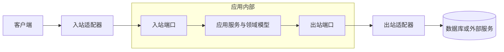

> 形而上者谓之道，形而下者谓之器
>
> ——《周易·系辞上》

## 01. 只有砖瓦还不够

实体、值对象、聚合、资源库、领域服务和领域事件，为我们提供了构建领域模型的砖瓦。但只有砖瓦还不足以建成一座大厦：系统还需要明确哪些组件承担用例编排，哪些组件实现业务规则，哪些组件处理数据库、消息和网络等技术细节，以及依赖应该朝什么方向流动。

架构就像大厦的梁柱。它不直接决定每一块砖瓦的内容，却通过承重结构和连接方式，保护最重要的部分不被外界变化轻易破坏。

DDD 并不强制绑定某一种架构。分层架构、六边形架构、洋葱架构和整洁架构的表现形式各不相同，但它们与 DDD 结合时通常追求同一个目标：

**让领域模型处于系统核心，并隔离外部技术细节。**

如果只是创建几个名为 `domain`、`application` 和 `infrastructure` 的目录，却依然让领域对象依赖 ORM、HTTP 请求或消息客户端，那么系统得到的只是 DDD 风格的外观，而不是受架构保护的领域模型。

## 02. DDD 与架构的关系

DDD 关注的是业务知识如何被发现、建模和表达；架构关注的是系统各部分如何组织、依赖和协作。两者解决的问题不同，却会相互影响。

领域模型需要调用资源库、时钟、事件发布器或外部服务，但这些能力往往依赖数据库、消息中间件和网络。若领域层直接依赖具体技术，它就会被实现细节牵制。更换数据库或测试业务规则时，原本稳定的业务代码也不得不随之变化。

解决这个问题的关键，不是让领域层与外部世界彻底断绝联系，而是在核心模型和外部技术之间建立稳定的抽象：

- 核心模型声明自己需要什么能力。
- 外围组件负责实现这些能力。
- 组装代码在系统边界完成具体实现的注入。
- 依赖从易变的技术细节指向相对稳定的业务抽象。

这样，业务代码仍然可以使用持久化、消息和外部服务，却不必知道这些能力由 JPA、RabbitMQ 还是 HTTP 客户端提供。

## 03. 分层架构下的 DDD

分层架构下的 DDD 可以视为对传统 Web 三层架构的一种扩展。它不再把所有业务逻辑都放进 Service 层，而是进一步区分应用用例与领域规则。

常见的四层划分如下：

| 层次 | 职责 |
| --- | --- |
| 用户界面层 | 接收来自用户或其他系统的请求，转换输入并呈现结果 |
| 应用层 | 定义系统提供的用例，协调领域对象和外部能力，不保存核心业务规则 |
| 领域层 | 表达业务概念、状态、行为和规则，是业务软件的核心 |
| 基础设施层 | 实现持久化、消息、网络、文件等技术能力，并完成系统组装 |

一次典型请求可能沿着下面的路径流动：

1. 用户界面层把 HTTP 请求转换成应用命令。
2. 应用服务加载聚合并调用领域行为。
3. 领域对象执行判断并改变状态，必要时产生领域事件。
4. 应用服务通过资源库保存聚合，并协调事件发布。
5. 基础设施适配器把抽象操作转换成数据库语句或消息。
6. 用户界面层把用例结果转换成响应。

这种分工的重点不是“上层调用下层”这么简单，而是让每一层只承担与其抽象层次相匹配的职责。

例如，Controller 不应该决定订单能否取消；应用服务不应该用一串 `if` 拼装核心计价规则；领域实体也不应该自己开启事务或发送 RabbitMQ 消息。

一个采用分层架构的图书模块可以组织为：

```text
book
  ├── interfaces                          # 用户界面层
  │   ├── rest                            # REST 资源与请求转换
  │   └── subscriber                      # 入站消息订阅者
  │
  ├── application                         # 应用层
  │   ├── command                         # 用例输入
  │   ├── service                         # 应用服务
  │   └── view                            # 用例输出
  │
  ├── domain                              # 领域层
  │   ├── event                           # 领域事件
  │   ├── model                           # 实体、值对象与聚合
  │   ├── repository                      # 资源库抽象
  │   └── service                         # 领域服务
  │
  └── infrastructure                      # 基础设施层
      ├── messaging                       # 消息实现
      ├── persistence                     # 持久化实现
      └── security                        # 安全与系统配置
```

目录可以帮助团队理解职责，却不能替代依赖规则。即使文件放在 `domain` 目录下，只要它导入了 Web 框架请求对象，它仍然泄漏了外部技术。

## 04. 依赖倒置：让领域层远离技术细节

分层结构经常被画成自顶向下的调用关系，但调用方向并不等于源码依赖方向。

根据依赖倒置原则（Dependency Inversion Principle，DIP），高层策略不应该依赖低层实现，二者都应该依赖抽象。对 DDD 来说，领域模型和应用用例属于更高层的策略，数据库、消息系统和第三方接口则属于更容易变化的实现细节。

以调整库存用例为例，`InventoryApplicationService.adjust` 先通过资源库加载库存项，再调用领域行为调整数量，最后保存结果。在持久化这项协作上，应用服务只依赖 `InventoryItemRepository`，并不知道数据最终由哪种数据库或持久化框架保存：

```java
package com.example.bookstore.book.application.service;

public class InventoryApplicationService {
    private final InventoryItemRepository inventoryRepo;

    @Transactional(rollbackFor = Throwable.class)
    public void adjust(long bookId, AdjustingStockCommand command) {
        InventoryItem item = inventoryRepo.itemOfBookId(bookId)
                .orElseThrow(() -> new InventoryNotFoundException(bookId));

        item.adjustTo(command.getQuantity());
        inventoryRepo.update(item);
    }
}
```

`InventoryItemRepository` 接口位于领域层。它使用领域对象表达读写意图，不暴露数据库表、持久化对象或 JPA API：

```java
package com.example.bookstore.book.domain.repository;

import com.example.bookstore.book.domain.model.InventoryItem;

import java.util.Optional;

public interface InventoryItemRepository {
    Optional<InventoryItem> itemOfBookId(Long bookId);

    boolean hasItemOfBookId(Long bookId);

    void add(InventoryItem item);

    void update(InventoryItem item);

    void deleteByBookId(Long bookId);
}
```

基础设施层的 `InventoryItemRepositoryJpaAdapter` 反过来实现这个接口。它负责调用 Spring Data JPA，并在持久化对象与领域对象之间转换：

```java
package com.example.bookstore.book.infrastructure.persistence;

@Repository
@RequiredArgsConstructor
public class InventoryItemRepositoryJpaAdapter
        implements InventoryItemRepository {
    private final InventoryItemPOJpaRepository jpaRepo;

    @Override
    public Optional<InventoryItem> itemOfBookId(Long bookId) {
        return jpaRepo.findByBookId(bookId)
                .map(InventoryItemPOAssembler::toDomain);
    }

    @Override
    public void update(InventoryItem item) {
        Assert.notNull(item, "InventoryItem is required");
        Long id = item.id();
        Assert.notNull(id, "Existing inventory item ID is required for update");
        Assert.isTrue(
                jpaRepo.existsById(id),
                "Existing inventory item must be present before update"
        );
        jpaRepo.save(InventoryItemPOAssembler.toPO(item));
    }
}
```

这条链路有两种方向：

- 运行时调用方向是 `InventoryApplicationService → InventoryItemRepository → InventoryItemRepositoryJpaAdapter → InventoryItemPOJpaRepository → 数据库`。
- 源码依赖方向是 `InventoryApplicationService → InventoryItemRepository ← InventoryItemRepositoryJpaAdapter`。

应用服务在运行时调用基础设施实现，但源码中没有导入 `InventoryItemRepositoryJpaAdapter`、`InventoryItemPO` 或 Spring Data JPA API。相反，JPA 适配器依赖领域层声明的 `InventoryItemRepository`。Spring 在系统边界完成接口与实现的组装，这正是“倒置”的含义。

这种结构也让应用用例更容易测试。`InventoryApplicationServiceUnitTest` 可以用 Mock 替代 `InventoryItemRepository`，直接验证库存数量发生变化并调用了更新操作，无需启动数据库。以后改用 JDBC、MongoDB 或内存存储时，只需要提供新的适配器并调整组装配置，应用用例和领域模型无需了解替换过程。

依赖倒置并不会消除持久化本身的复杂度。事务边界、并发更新、对象映射和数据库约束仍然需要明确设计，但它们可以被限制在应用层与基础设施层的适当位置，不必侵入库存领域模型。

## 05. 六边形架构：端口与适配器

分层架构强调不同抽象层次的职责，**六边形架构**（Hexagonal Architecture）则更突出系统内部与外部之间的边界。它也被称为**端口与适配器架构**（Ports and Adapters Architecture）。

这里的“六边形”并不代表系统必须拥有六个面。这个图形只是为了避免人们继续把系统理解成固定的上下层调用栈，并强调应用可以通过多个方向与外部交互。

六边形内部包含应用用例和领域模型，外部则是 Web、命令行、定时任务、数据库、消息系统和第三方服务。内外双方不直接耦合，而是通过端口和适配器通信。



六边形架构中的端口是解耦的关键。**入口端口体现了“封装”的思想；出口端口体现了“抽象”的思想**。

一个采用六边形架构的图书商城系统订单模块可能具有如下的包目录结构：

```text
order
  ├── domain                          # 领域层
  │
  ├── northbound                      # 北向/入站
  │   ├── local                        # 入站端口
  │   ├── message                      # 入站消息
  │   └── remote                       # 入站适配器
  │       ├── resource                 # REST 资源/控制器
  │       ├── security                 # API 安全配置
  │       └── subscriber               # 消息订阅者
  │
  └── southbound                      # 南向/出站
	  ├── adapter                     # 出站适配器
	  │   ├── event                   # 事件发布适配器
	  │   ├── oauth2                  # OAuth2 客户端配置
	  │   ├── persistence             # 持久化适配器
	  │   └── service                 # 外部服务适配器
	  ├── message                     # 出站消息
	  └── port                        # 出站端口
```

## 06. 从目录结构回到依赖方向

分层架构与六边形架构并不是互斥方案。前者有助于区分用户界面、应用、领域和基础设施的抽象层次；后者有助于识别驱动应用的一侧和被应用驱动的一侧。一个系统完全可以同时使用两种视角。

判断架构是否真正保护了领域模型，可以检查几个问题：

- 领域对象能否在不启动 Web 框架和数据库的情况下执行核心规则？
- 应用服务表达的是业务用例，还是堆积了实体本应承担的规则？
- 资源库接口是否面向聚合和业务需求，而不是照搬 ORM API？
- 外部系统的 DTO 是否直接渗入领域模型？
- 更换数据库、消息中间件或远程客户端时，核心业务代码是否需要同步修改？
- 目录之间的源码依赖是否与团队宣称的架构一致？

当外部系统拥有一套与本地模型不兼容的语言时，可以引入**防腐层**（Anticorruption Layer，ACL）完成转换。防腐层可能由适配器、转换器和门面共同组成，用本地语言封装外部模型，避免外部概念污染内部上下文。

防腐层不是基础设施层的同义词。基础设施层还包含数据库、消息和系统配置等大量技术实现；防腐层特指两个模型边界之间的翻译与隔离机制。它通常位于外部集成相关的适配器中，但其设计依据来自上下文之间的模型关系。

架构也不是层数越多越好。对于业务规则很少的应用，过度拆分接口、DTO、装配器和适配器，只会增加理解和维护成本。架构的价值在于约束变化，而不在于制造文件。

## 07. 小结

DDD 提供领域建模的方法，架构则为模型建立保护结构。

分层架构通过职责层次区分用例、业务规则和技术实现；六边形架构通过端口与适配器区分应用内部与外部世界；依赖倒置让核心代码声明所需抽象，并由外围实现这些抽象。

目录名称、框架注解和六边形图都只是结构的外在表现。真正的梁柱是清晰的职责、稳定的边界和朝向核心的依赖方向。只有这些约束真实存在，领域模型才不会在一次次技术更换和需求迭代中逐渐被侵蚀。

## 引用

1.  《领域驱动设计——软件核心复杂性应对之道》（Eric Evans 著，人民邮电出版社）
2.  《实现领域驱动设计》（Vaughn Vernon 著，电子工业出版社）
3.  《解构领域驱动设计》（张逸 著，人民邮电出版社）
4.  [《Hexagonal Architecture》](https://alistair.cockburn.us/hexagonal-architecture/)（Alistair Cockburn）
