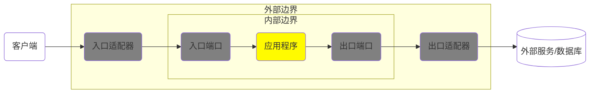

> 名无固宜，约之以命
>
> ——《荀子·正名》

## 01. 引言

作为一个有些“代码洁癖”的程序员，工作中最让我头疼的，莫过于接手质量糟糕的代码。

每当我看到大量晦涩、冗余、缺少设计思考的代码堆在一起，尤其是那些把所有业务逻辑都塞进一个“万能 Service”里的实现时，总要先花很长时间一行一行地阅读，试图理解作者究竟想通过这段流程表达什么业务意图。很多时候，真正令人疲惫的并不是代码量本身，而是代码没有结构、没有边界、没有能够承载业务含义的模型。

这种经历越多，我就越发觉得，程序员确实应该系统学习一些设计模式，尤其是长期使用面向对象语言开发业务系统的程序员。

设计模式并不是为了炫技，也不是为了把原本简单的代码写得复杂。恰恰相反，优秀的设计模式是在帮助开发者建立一种有约束的表达方式：什么逻辑应该放在哪里，哪些对象应该承担哪些职责，哪些变化应该被隔离，哪些关系不应该被随意耦合在一起。

埃里克·伽玛等人在《设计模式：可复用面向对象软件的基础》中提到，设计模式描述了在特定环境下反复出现的设计问题，以及相应解决方案的核心。换言之，设计模式沉淀的并不是某一段可以复制粘贴的代码，而是前人在长期软件开发中总结出的结构性经验。它帮助我们避免在相同的问题上反复试错，也帮助团队用更统一的方式讨论和组织代码。

当然，软件开发从来不存在一种放之四海而皆准的设计方案。不同项目的业务复杂度、交付周期、团队经验和技术栈各不相同，设计模式也不应该被机械套用。但这并不意味着设计可以被忽略。越是复杂、变化频繁、生命周期较长的系统，越需要通过一定的设计原则和模式来维持秩序。

没有设计约束的代码，短期看似灵活，长期往往会变成隐性成本。它会让新增功能越来越困难，让 Bug 越来越难定位，让业务规则散落在各处，也让后来者难以理解系统真正的意图。相反，恰当遵循设计模式，虽然会在初期带来一定的抽象成本，却能显著提升代码的可读性、可维护性和可扩展性。

在众多设计思想中，我尤其推崇**领域驱动设计**（Domain-Driven Design，DDD）。

我和 DDD 的初次邂逅还是在第一家公司工作的时候。那个时候对设计模式甚至都知之甚少，可是有一天我被项目组长分配去修改一个此前从没接触的微服务模块的功能。克隆好这个模块的代码试着看了一下，看到各种不知所云的 `application`、`domain`、`infrastructure` 的包名，骨子里都刻着传统 Web 三层架构的基因的我顿时感到手足无措了。于是不得不去了解一下这是种什么设计模式。

为了理解这种设计方式，我开始阅读 Eric Evans 的《领域驱动设计》。这本书从思想层面对 DDD 进行了系统阐述，但抽象程度较高，初学时并不轻松。之后我又阅读了 Vaughn Vernon 的《实现领域驱动设计》，它更侧重实现层面的解释，对理解 DDD 的战术设计帮助很大。最后，张逸的《解构领域驱动设计》则进一步帮助我将战略设计、战术设计与工程实践联系起来。（顺便提一下，《解构领域驱动设计》的作者张逸就是我第一家公司的技术总监，也是《实现领域驱动设计》的中文译者。现在想来也好荣幸能和这样优秀的前辈共事过）。

## 02. 什么是领域驱动设计

领域驱动设计的概念产生于 Eric Evans 写的《Domain-Driven Design》一书。它并非单一的设计模式，而是一整套用于改进面向对象设计的方法论，尤其适用于业务复杂度较高的软件系统。

DDD 的基本出发点是：**复杂软件系统的核心复杂度通常不在技术实现，而在业务领域本身。**

对于一个业务复杂的系统而言，数据库、消息队列、缓存、RPC、Web 框架等技术设施固然重要，但它们并不是系统的核心。真正决定系统长期演进能力的，是代码是否准确表达了业务概念、业务规则和业务流程。

领域驱动设计强调把关注点放在领域建模，即以领域专家的视角建立的与该领域匹配的软件模型。技术实现则是完成系统业务目标的辅助手段；DDD 明确划分领域与技术实现之间的边界，隔离技术实现对领域建模的干扰。

## 03. 领域、子域和限界上下文

在 DDD 中，“领域（Domain）”“子域（Subdomain）”与“限界上下文（Bounded Context）”属于**战略设计**层面的核心概念，理解它们是掌握 DDD 的前提。

**领域**通常指软件系统所要覆盖的一组业务活动和业务知识。从宏观角度看，一个组织的整体业务可以被视为一个领域；从微观角度看，一个领域又可以继续拆分为多个更细粒度的问题空间。

以图书电商系统为例，整个图书电商平台可以视为一个领域。它包含商品管理、订单交易、库存管理、支付结算、物流配送、会员营销等不同业务部分。

**子域**是对领域的进一步拆分。不同子域承载不同的业务能力，其复杂度、变化频率和战略价值也不相同。

在 DDD 中，子域通常可以分为三类：

-   核心子域：体现业务竞争力的关键部分，是系统最值得投入建模精力的区域
-   支撑子域：对业务运行很重要，但不直接构成核心竞争力
-   通用子域：行业内较通用的问题，可通过成熟方案或第三方系统解决

例如，在图书电商系统中，如果平台的核心竞争力是个性化推荐，那么“推荐”可能是核心子域；“订单”和“库存”可能是支撑子域；“短信通知”“文件存储”“权限认证”则更接近通用子域。

这种划分的意义在于：**不是所有模块都值得投入同等设计成本。** DDD 并不主张对系统的每个角落都进行复杂建模，而是强调把主要精力放在真正复杂、真正关键的业务区域。

**限界上下文**用于明确模型的适用范围。它通过清晰边界限定术语、规则和对象模型的语义，使同一个概念在不同语境下可以拥有不同含义。

例如，“用户”这个概念在不同上下文中可能具有不同语义：

-   在认证授权上下文中，用户代表系统访问主体，关注账号、密码、角色、权限等信息。
-   在订单上下文中，用户代表下单人，关注收货地址、联系方式、交易记录等信息。
-   在营销上下文中，用户代表运营对象，关注会员等级、优惠券、活动触达等信息。

这些“用户”在现实世界中可能指向同一个人，但在软件模型中不应强行合并为一个庞大的 `User` 对象。否则，模型会逐渐膨胀，语义会越来越混乱，最终成为所有上下文共同依赖的“上帝对象”。

限界上下文的价值在于：**承认不同语境中的模型差异，并通过边界管理这种差异。**

理想情况下，一个限界上下文对应一个子域。但在实际工程中，一个上下文也可能覆盖多个关联紧密的子域。关键不在于形式上的一一对应，而在于上下文内部是否保持语义一致、模型内聚，并尽量减少对其他上下文内部模型的直接依赖。

## 04. 领域建模的基本要素

战略设计帮助我们识别边界，战术设计则帮助我们在边界内部构建模型。DDD 提供了一系列战术设计模式，用于指导领域对象的职责划分和协作方式。

如果把战略性模式比作 DDD 大厦的栋梁，战术性模式就是其中的一砖一瓦。

### 4.1. 实体

**实体**（Entity）是具有唯一身份标识的领域对象，其核心特征在于：同一实体的身份特征在整个生命周期中保持不变，即便其属性发生变化，实体本身仍然是同一个。

例如，订单是电商系统中最典型的实体示例。订单状态可以不断变化，但只要订单 ID 不变，它始终代表同一笔业务交易。

一个设计良好的实体通常包含三部分内容：

-   身份标识（ID）
-   状态属性
-   领域行为

**身份标识（ID）**是实体对象的必要标志，在 DDD 中，没有 ID 的领域对象就不是实体。由于实体的状态可以变更，这意味着我们不能根据实体的属性值判断其身份，如果没有唯一的 ID，就无法跟踪实体的状态变更。实体的 ID 既可以是无意义的通用类型的值，也可以是有意义的蕴含领域概念的值，如订单的实体 ID 可能会包含下单渠道号、支付渠道号、业务类型、下单日期等信息。

实体的**属性**用以说明实体的瞬时特征。属性既可能是不可再分的原子属性，也可能是通过自定义类型来表现的组合属性。

如将 `Book` 实体定义为：

```java
package com.janwee.bookstore.book.domain.model;

public class Book {
    private Long id;
    private String name;
    private Price price;
    private LocalDate publishedAt;
    private String publisher;
    private Long authorId;

    public Book() {
        this.publishedAt = LocalDate.now();
    }

    public Price price() {
        return price;
    }

    public void changePriceTo(Price price) {
        if (price == null || price.amount().compareTo(BigDecimal.ZERO) < 0) {
            throw InvalidBookException.negativePrice();
        }
        this.price = price;
    }
}
```

很多面向对象语言的程序员喜欢给实体堆砌一大堆属性而忽略给实体定义操作这些属性的方法，每当需要变更实体的状态就在业务服务中通过实体 `getter` 和 `setter` 方法去操作实体状态。这种做法实在有些得不偿失，我们称这样的对象为“贫血对象”。这样的实体只是作为属性容器存在，而不是程序中的有机组成部分。

DDD 提倡为实体定义表达**领域行为**的方法而不是让外部调用者来操作自己的状态，这体现了“职责分治”的思想。业务代码组成的实现模型是领域模型的一部分，业务代码的类名、方法名应从业务角度表达领域逻辑。例如，修改图书名称的领域行为应该定义为 `renameTo(newName)`，而非 `setName(newName)`：

实体的领域行为用以操作对象状态的变换，修改的只是对象的内存状态，与持久化无关。

```java
package com.bookstore.book.domain.model;

public class Book {

    private String name;

    public void renameTo(String newName) {
        if (newName == null || newName.isBlank()) {
            throw new IllegalArgumentException("Book name must not be blank.");
        }
        this.name = newName;
    }
}
```

### 4.2. 值对象

与实体不同，**值对象**（Value Object）没有独立身份，其意义完全由属性值决定。两个值对象只要属性完全相同，就可以视为等价。

值对象通常是不可变的，这一特性使其在并发环境下更加安全，也更易于维护。

如果我们只关心一个对象的属性时，应该把它归类为值对象。因为值对象不用考虑管理身份标识，不用维护生命周期，所以它比实体更容易维护。在进行领域设计建模时，可优先考虑使用值对象而非实体对象建模。

例如，在定义上面的 `Book` 实体的价格时，我们只需要关注图书价格的币种和金额，那么 `Price` 类型就应该定义为值对象而非实体：

```java
package com.bookstore.book.domain.model;

import java.math.BigDecimal;
import java.util.Currency;
import java.util.Objects;

public final class Price {

    private final Currency currency;
    private final BigDecimal amount;

    private Price(Currency currency, BigDecimal amount) {
        this.currency = Objects.requireNonNull(currency, "currency must not be null");
        this.amount = Objects.requireNonNull(amount, "amount must not be null");
    }

    public static Price of(Currency currency, BigDecimal amount) {
        if (amount.compareTo(BigDecimal.ZERO) < 0) {
            throw new IllegalArgumentException("Price amount must not be negative.");
        }
        return new Price(currency, amount);
    }

    public Currency currency() {
        return currency;
    }

    public BigDecimal amount() {
        return amount;
    }

    public Price add(Price other) {
        if (!this.currency.equals(other.currency)) {
            throw new IllegalArgumentException("Cannot add prices with different currencies.");
        }
        return new Price(this.currency, this.amount.add(other.amount));
    }

    @Override
    public boolean equals(Object o) {
        if (!(o instanceof Price other)) {
            return false;
        }
        return currency.equals(other.currency)
                && amount.compareTo(other.amount) == 0;
    }

    @Override
    public int hashCode() {
        return Objects.hash(currency, amount.stripTrailingZeros());
    }
}
```

### 4.3. 聚合

**聚合**（Aggregate）用于定义对象之间的边界与一致性规则。它由一个聚合根实体及其内部关联实体组成，外部只能通过聚合根访问聚合内部成员。

聚合的概念之所以存在是因为类之间必然存在关系。这些关系包括**泛化关系**（父类与子类之间的关系）、**关联关系**（用以指定一个类对象与另一个类对象之间的连接信息）以及**依赖关系**（代表一个类使用了另一个类的信息或服务）。

DDD 引入聚合概念的目的是通过合理的对象边界控制对象之间的关系，在边界内保证对象的一致性与完整性，在边界外作为一个自治单元参与业务行为的协作。

以订单系统为例，订单和订单项可以组成一个聚合，其中订单是聚合根。外部系统要修改订单项，必须通过订单这个聚合根来进行操作。

```java
package com.bookstore.order.domain.model;

import java.util.ArrayList;
import java.util.List;

public class Order {

    private OrderId id;
    private List<OrderItem> items = new ArrayList<>();

    public void changeItemQuantity(OrderItemId itemId, int quantity) {
        if (quantity <= 0) {
            throw new IllegalArgumentException("Quantity must be greater than zero.");
        }

        OrderItem item = items.stream()
                .filter(orderItem -> orderItem.id().equals(itemId))
                .findFirst()
                .orElseThrow(() -> new OrderItemNotFoundException(itemId));

        item.changeQuantityTo(quantity);
    }
}
```

上述的 `Order` 与 `OrderItem` 之间通过**对象引用**形成聚合，也可以根据需求考虑使用**身份标识引用**来组合对象。如下面的 `Book` 和 `Author` 之间形成的聚合：

```java
package com.bookstore.book.domain.model;

public class Book {

    private AuthorId authorId;

    public void changeAuthorTo(AuthorId newAuthorId) {
        if (newAuthorId == null) {
            throw new IllegalArgumentException("Author id must not be null.");
        }
        this.authorId = newAuthorId;
    }
}
```

### 4.4. 资源库

**资源库**（Repository）是用于持久化和检索聚合的抽象。它的核心作用是隔离领域模型与数据访问技术，使领域层不必关心数据库、ORM、SQL、缓存等基础设施细节。

资源库通常面向聚合根设计。因为聚合内部对象的生命周期由聚合根管理，外部不应绕过聚合根直接保存或修改内部对象。

例如，在图书上下文中，可以定义图书资源库接口：

```java
package com.janwee.bookstore.book.domain.repository;

public interface BookRepository {
    Page<Book> booksOf(Pageable pageable);

    Optional<Book> bookOf(Long id);
}
```

这个接口只表达领域需要的持久化能力，并不暴露 JPA、SQL 或逻辑删除字段等技术细节。与 JPA 等持久化技术相关的代码可以放在基础设施层。

依赖 JPA 的资源库实现 `BookRepositoryJpaAdapter`：

```java
package com.janwee.bookstore.book.infrastructure.persistence;

@Repository
@RequiredArgsConstructor
public class BookRepositoryJpaAdapter implements BookRepository {
    private final BookPOJpaRepository jpaRepo;

    @Override
    public Page<Book> booksOf(Pageable pageable) {
        return jpaRepo.findAll(pageable)
                .map(BookPOAssembler::toDomain);
    }

    @Override
    public Optional<Book> bookOf(Long id) {
        return jpaRepo.findById(id)
                .map(BookPOAssembler::toDomain);
    }
}
```

将依赖 Spring Data JPA 等持久化注解的实体表示为持久化对象 `BookPO`：

```java
package com.janwee.bookstore.book.infrastructure.persistence.entity;

@Entity
@Table(name = "books")
@Getter
public class BookPO implements Serializable {
    @Serial
    private static final long serialVersionUID = 2266684333872541496L;
    @Id
    @GeneratedValue(strategy = GenerationType.SEQUENCE, generator = "seq_books")
    @SequenceGenerator(name = "seq_books", sequenceName = "book.seq_books", allocationSize = 1)
    private Long id;

    private String name;

    private String price;

    private LocalDate publishedAt;

    private String publisher;

    private Long authorId;

    protected BookPO() {
    }

    public BookPO(Long id, String name, String price, LocalDate publishedAt,
                  String publisher, Long authorId) {
        this.id = id;
        this.name = name;
        this.price = price;
        this.publishedAt = publishedAt;
        this.publisher = publisher;
        this.authorId = authorId;
    }
}
```

负责转换 `Book` 对象和 `BookPO` 对象的装配器 `BookPOAssembler`：

```java
package com.janwee.bookstore.book.infrastructure.persistence.assembler;

public class BookPOAssembler {
    public static Book toDomain(BookPO po) {
        if (po == null) {
            return null;
        }

        return new Book(
                po.getId(),
                po.getName(),
                toPrice(po.getPrice()),
                po.getPublishedAt(),
                po.getPublisher(),
                po.getAuthorId()
        );
    }

    public static BookPO toPO(Book book) {
        if (book == null) {
            return null;
        }

        return new BookPO(
                book.id(),
                book.name(),
                toPriceValue(book.price()),
                book.publishedAt(),
                book.publisher(),
                book.authorId());
    }

    private static String toPriceValue(Price price) {
        if (price == null) {
            throw new IllegalArgumentException("Price cannot be null");
        }
        return price.toString();
    }

    private static Price toPrice(String dbValue) {
        if (dbValue == null) {
            throw new IllegalArgumentException("Price cannot be null");
        }
        String[] values = dbValue.split("/");
        if (values.length != 2) {
            throw new IllegalArgumentException("Price is not a valid price");
        }
        return Price.of(Currency.getInstance(values[1]), new BigDecimal(values[0]));
    }
}
```

调用者只依赖 `BookRepository`，并不知道领域对象在数据库中的表结构与映射方式。这样，即使未来调整字段映射，或者从关系型数据库迁移到文档数据库，也可以尽量将影响限制在基础设施层。

资源库的设计要避免两个极端：

一是把资源库设计成通用 CRUD 工具，导致领域语义缺失；二是把复杂业务逻辑塞进资源库，使它承担本不属于持久化抽象的职责。

资源库应当表达“如何获取和保存聚合”，而不是替代领域对象完成业务决策。

### 4.5. 领域服务

实体、值对象、聚合以及资源库中定义的丰富的领域行为已经足够表示系统中的大部分业务操作，但仍有不适合放在这些元素中的领域行为，这部分领域行为在 DDD 中就应该交给**领域服务**（Domain Service）来完成。

例如，将验证图书是否符合发布策略的领域行为交给名为 `BookPublicationPolicy` 的领域服务：

```java
@Service
public class BookPublicationPolicy {
    private final AuthorRepository authorRepo;

    @Autowired
    public BookPublicationPolicy(AuthorRepository authorRepo) {
        this.authorRepo = authorRepo;
    }

    public void check(Book book) {
        if (book.authorId() != null
                && !authorRepo.hasAuthorOf(book.authorId())) {
            throw InvalidBookException.unavailableAuthor();
        }
    }
}
```

上面的 `BookPublicationPolicy` 校验 `Book` 对象引用的 `Author` 对象是否存在于资源库中，由于资源库中是否存在 `Author` 对于领域实体来说是未知数，放在资源库中又会使得资源库丧失管理资源生命周期的纯粹性，此时就需要将它们放到领域服务中。

### 4.6. 领域事件

**领域事件**（Domain Event）表示领域中**已经发生的事情**，表达了实体的状态变更和迁移。通过发布和订阅领域事件，我们可以实现松耦合的领域对象之间的交互。以“领域事件”为核心进行领域建模的方式是对经典建模世界观的颠覆，推倒了堆砌着静态领域概念的名词城堡，重新建立了关注状态转移的动态过程。领域事件模型是不变的，无论因为什么导致了状态迁移，产生的每个事实都不可变更。

作为已经发生的事实，事件的命名应采用动词的过去形态，如订单已创建的事件可以被命名为 `OrderCreated`。

```java
package com.bookstore.order.domain.event;

public class OrderCreated extends DomainEvent implements Event {
    private final Long orderId;
    private final Long bookId;
    private final int amount;
    private final LocalDateTime occurredOn;
}
```

## 05. 领域驱动设计的架构

DDD 并不强制绑定某种具体架构。它关注的是领域模型的表达与边界管理，而不是某个固定目录结构。

在工程实践中，DDD 常与分层架构、六边形架构、洋葱架构、整洁架构等形式结合使用。这些架构虽然表现形式不同，但目标类似：让领域模型处于系统核心位置，并隔离外部技术细节。

### 5.1. 分层架构下的 DDD

分层架构下的 DDD 通常可以视为对传统 Web 三层架构的改良。它将系统划分为用户界面层、应用层、领域层和基础设施层。

Eric Evans 对各层职责有过经典划分：

| 层次 | 职责 |
| --- | --- |
| 用户界面层（展现层） | 负责向用户展现信息以及解释用户命令 |
| 应用层 | 定义软件要完成的任务，并指挥表达领域概念的对象来解决问题。不包含业务逻辑，不保留业务状态，但保留应用任务的进度状态 |
| 领域层 | 业务软件的核心。用于表达业务概念、业务状态信息以及业务规则。 |
| 基础设施层 | 为上面各层提供通用的技术能力：为应用层传递消息，为领域层提供持久化机制，为用户界面层绘制屏幕组件等 |

分层架构的重点不只是“分包”，而是明确不同层次的职责边界。

用户请求进入系统后，通常由展现层接收并转换为应用层命令；应用层负责编排用例，调用领域对象、领域服务和资源库；领域层完成核心业务判断；基础设施层负责技术实现。

分层架构遵循“技术为本，用户至上”的认知规则，层次越往上，就越面向用户和业务；层次越往下，就越通用，越面向技术。层间关系是正交的。至于引入应用层，则是为了给调用者提供完整的业务用例，使调用者无需与细粒度的领域模型直接协作。

自顶向下的分层结构并不意味着我们必须使用自顶向下的依赖模式。根据面向对象设计的依赖倒置原则（Dependency Inversion Principle，DIP），高层模块不应该依赖于低层模块，二者都应该依赖于抽象。遵循这一原则，作为调用者的高层模块应该依赖低层模块的抽象。这样的依赖方式可以避免高层模块受制于低层模块。

以一个使用分层架构 DDD 的图书商城系统的订单上下文为例，我们可以将不与具体技术实现挂钩的领域事件发布者接口放到领域层，将基于 RabbitMQ 的领域发布者实现放到基础设施层（也即防腐层）。

`com.bookstore.order.domain.service` 包下的 `EventPublisher` 接口：

```java
package com.bookstore.order.domain.service;

public interface EventPublisher {
    void publish(Event... events);
}
```

`com.bookstore.order.infrastructure.messaging` 包下的 `EventPublisher` 实现：

```java
package com.bookstore.order.infrastructure.messaging;

public class RabbitEventPublisher implements EventPublisher {

    @Override
    public void publish(Event... events) {

        Stream.of(events).parallel().forEach(event -> {
            if (event instanceof OrderCreated) {
                queueOrderCreated.offer((OrderCreated) event);
            }
            //...
        });
    }
}
```

依赖于 `EventPublisher` 的订单应用服务 `OrderApplicationService` 调用 `EventPublisher` 发布订单生成的领域事件：

```java
package com.bookstore.order.application;

public class OrderApplicationService {
    private EventPublisher eventPublisher;

    public void createOrder(OrderingRequest request) {
        Order order = Order.create().ofBook(request.getBookId()).ofAmount(request.getAmount());
        BookReview bookReview = bookClient.check(order);
        if (bookReview.isUnavailable()) {
            throw InvalidOrderException.unavailableBook();
        }
        orderRepo.save(order);
        OrderCreated orderCreated = new OrderCreated(order.id(), order.bookId(), order.amount(),
                order.createdAt());
        eventPublisher.publish(orderCreated);
    }
}
```

这样，如果后续想要更换消息中间件实现，只需要替换掉基础设施层的 `RabbitEventPublisher`，领域层的 `EventPublisher` 接口及依赖该组件的下游调用者不受影响。层次之间的变化互不干扰。

一个采用分层架构的图书商城系统图书模块可能有如下的包目录结构：

```text
book
  ├── application                        # 应用层
  │   ├── assembler                      # 视图/命令组装器
  │   ├── command                        # 命令对象
  │   ├── event                          # 集成事件
  │   ├── service                        # 应用服务
  │   └── view                           # 视图对象
  │
  ├── domain                             # 领域层
  │   ├── exception                      # 领域异常
  │   ├── model                          # 领域模型
  │   ├── repository                     # 资源库接口
  │   └── service                        # 领域服务
  │
  ├── infrastructure                     # 基础设施层
  │   ├── messaging                      # 消息适配器
  │   ├── persistence                    # 持久化适配器
  │   │   ├── assembler                  # PO 组装器
  │   │   ├── entity                     # 持久化对象
  │   │   ├── jpa                        # JPA Repository
  │   │   └── *RepositoryJpaAdapter      # 资源库适配器
  │   └── security                       # 安全配置
  │
  └── interfaces                         # 接口层
	  ├── rest                           # REST 资源/控制器
	  └── subscriber                     # 消息订阅者
```

### 5.2. 六边形架构下的 DDD

相比于分层架构从上到下的层级结构，六边形架构呈现出从外到内的层级结构，将领域逻辑封装在六边形的边界内，通过入口和出口两个方向的**端口**和**适配器**与外界通信，（北向）入口负责处理领域边界外部发送的请求，（南向）出口负责向位于外部的设备、服务或数据库发起请求。就像洋葱一样，最有价值的部分层层包裹在洋葱皮内。



六边形架构中的端口是解耦的关键。**入口端口体现了“封装”的思想；出口端口体现了“抽象”的思想**。

一个采用六边形架构的图书商城系统订单模块可能具有如下的包目录结构：

```text
order
  ├── domain                          # 领域层
  │
  ├── northbound                      # 北向/入站
  │   ├── local                        # 入站端口
  │   ├── message                      # 入站消息
  │   └── remote                       # 入站适配器
  │       ├── resource                 # REST 资源/控制器
  │       ├── security                 # API 安全配置
  │       └── subscriber               # 消息订阅者
  │
  └── southbound                      # 南向/出站
	  ├── adapter                     # 出站适配器
	  │   ├── event                   # 事件发布适配器
	  │   ├── oauth2                  # OAuth2 客户端配置
	  │   ├── persistence             # 持久化适配器
	  │   └── service                 # 外部服务适配器
	  ├── message                     # 出站消息
	  └── port                        # 出站端口
```

## 06. DDD 的价值

DDD 的价值并不在于增加目录层级，也不在于引入更多类、接口和设计名词。它真正解决的是复杂业务系统在长期演进中的几个核心问题：业务表达不清、边界混乱、技术细节侵入、系统耦合过高以及团队沟通成本不断上升。

### 6.1. 让代码表达业务，而不是淹没业务

传统过程式业务代码很容易演变为“事务脚本”：在一个 Service 方法中查询数据、判断状态、修改字段、调用外部接口、保存结果、发送消息，所有逻辑按流程堆叠在一起。

这种代码短期内看似直接，长期却难以维护。因为业务概念没有被显式建模，规则隐藏在流程细节中。后来的维护者必须阅读完整代码路径，才能理解一个业务动作的真实含义。

DDD 倡导通过实体、值对象、聚合和领域服务显式表达业务规则。比如，与其在应用服务中写：

```java
book.setName(request.getName());
book.setPrice(request.getPrice());
book.setUpdatedAt(LocalDateTime.now());
```

不如让领域对象表达自己的业务行为：

```java
book.renameTo(command.name());
book.changePriceTo(command.price());
```

后者的价值不只是命名更优雅，而是将状态变更背后的业务约束封装到了模型内部。代码因此更接近业务语言，也更容易被理解和讨论。

### 6.2. 明确边界，控制复杂度

软件复杂度往往不是一次性产生的，而是在持续迭代中逐渐积累的。一个对象最初可能只服务于某个简单场景，后来被越来越多模块复用，字段越来越多，方法越来越杂，最终成为无人敢改的核心类。

限界上下文和聚合边界的价值就在于控制复杂度扩散。

限界上下文告诉我们：不同语境下的模型不必强行统一。
聚合边界告诉我们：不是所有对象关系都应该直接连在一起。
上下文映射告诉我们：不同系统或模块之间应当通过明确关系协作。

边界不是为了制造隔离，而是为了让变化可控。一个模型只要能在自己的上下文中保持一致，就不必承担其他上下文的语义负担。

### 6.3. 隔离技术细节，保护领域模型

许多系统的领域代码会逐渐被技术细节污染。例如：

-   实体中充满 ORM 注解和数据库字段设计痕迹。
-   业务逻辑依赖 Web 框架的请求对象。
-   领域对象直接调用第三方 API。
-   Service 方法中混杂缓存、事务、消息和业务判断。
-   数据库表结构反向决定了对象模型。

这些问题会导致系统越来越“技术中心化”。业务规则被迫迁就技术实现，模型无法独立演进。

DDD 强调通过资源库、端口、适配器和基础设施层隔离技术细节。领域模型不需要知道数据来自 PostgreSQL、Elasticsearch 还是远程服务；也不需要知道事件最终发送到 RabbitMQ、Kafka 还是其他消息中间件。

这种隔离的意义在于：技术实现可以替换，领域知识应当稳定。

### 6.4. 统一语言降低沟通成本

DDD 中的统一语言（Ubiquitous Language）要求开发者与领域专家使用同一套业务语言讨论问题，并将这些语言落实到代码中。

这并不是简单的“命名规范”，而是建模活动的一部分。

如果业务人员说的是“下架图书”，代码里却叫 `deleteBook`；业务人员说的是“冻结账户”，代码里却叫 `updateStatus(3)`；业务人员说的是“订单履约”，代码里却分散在多个无语义的方法中，那么代码和业务之间就会出现翻译损耗。

统一语言可以让代码成为业务知识的载体。类名、方法名、事件名、异常名都应尽量反映真实业务语义。

例如：

```java
order.cancelBecausePaymentExpired();
book.markAsSoldOut();
account.freezeDueToRiskControl();
```

这些方法名本身就在描述业务事实，比单纯的 `setStatus` 更有表达力。

### 6.5. 与微服务架构天然互补

DDD 与微服务经常被放在一起讨论，这是因为二者都强调边界，但它们关注的层面不同。

微服务是一种架构风格，关注服务如何拆分、部署、通信和治理。
DDD 是一种建模方法，关注业务边界如何识别、模型如何表达、规则如何组织。

如果没有 DDD 的边界识别能力，微服务拆分很容易退化为按技术层、数据库表或团队分工进行机械切割。这样的服务虽然在部署上分开了，但业务上仍然高度耦合，最终形成“分布式单体”。

一个常见的反例是：

-   用户服务保存所有用户信息。
-   订单服务依赖用户服务获取大量用户字段。
-   营销服务也依赖用户服务。
-   权限服务、会员服务、风控服务都共享同一个用户模型。
-   任意一个字段变更都会影响多个服务。

表面上看，这是多个微服务；实质上，它们共享同一个隐含的全局模型，边界并不清晰。

DDD 可以帮助微服务识别更合理的拆分依据。服务边界应尽量与限界上下文对齐，而不是简单对应数据库表或 CRUD 模块。

例如，“用户”不一定应该作为所有场景下的统一服务模型。认证上下文可以拥有 `Account`，订单上下文可以拥有 `Buyer`，营销上下文可以拥有 `Member`，风控上下文可以拥有 `RiskSubject`。这些模型可以通过 ID、事件或防腐层关联，但不必共享同一个巨大的 `User` 对象。

### 6.6. 支持服务自治与演进

微服务的核心目标之一是服务自治。一个服务如果拥有清晰的领域边界、独立的数据模型和明确的外部契约，就可以在较小范围内独立演进。

DDD 为这种自治提供了建模基础：

-   限界上下文定义服务语义边界。
-   聚合定义事务一致性边界。
-   领域事件支持跨上下文异步协作。
-   防腐层隔离外部模型污染。
-   上下文映射帮助团队理解服务之间的关系。

例如，在订单创建后，订单上下文可以发布 `OrderCreated` 事件。库存上下文订阅该事件完成库存预留，积分上下文订阅该事件完成积分累计，通知上下文订阅该事件发送通知。

订单上下文不需要直接调用所有下游服务，也不需要理解它们的内部规则。每个上下文只处理自己负责的业务事实。

这种事件驱动协作方式并不意味着所有场景都要异步化，而是说明 DDD 可以为微服务之间的松耦合协作提供更自然的模型基础。

### 6.7. 提高系统的可测试性

DDD 还能够提升业务逻辑的可测试性。

如果业务规则散落在 Controller、Service、Repository 和外部接口调用之间，测试往往需要启动 Spring 容器、准备数据库、Mock 多个依赖，成本较高且反馈较慢。

而当核心规则被封装在实体、值对象、聚合和领域服务中时，许多测试可以脱离框架直接执行。

例如：

```java
@Test
void should_not_allow_negative_price() {
    assertThrows(IllegalArgumentException.class, () ->
            Price.of(Currency.getInstance("USD"), new BigDecimal("-1"))
    );
}
```

这类测试聚焦业务规则本身，不依赖 Web 框架、数据库或消息队列。它们更快、更稳定，也更能保护核心领域逻辑。

### 6.8. DDD 不是银弹

DDD 的价值明显，但它并不适用于所有系统。

如果系统只是简单 CRUD，业务规则很少，变化也不复杂，那么引入完整 DDD 结构可能会增加不必要的抽象成本。此时，清晰的分层架构和良好的命名规范已经足够。

DDD 更适合以下场景：

-   业务规则复杂。
-   系统生命周期较长。
-   需求变化频繁。
-   多团队协作开发。
-   模块之间边界容易混乱。
-   需要从业务能力角度拆分微服务。
-   代码需要长期承载领域知识。

因此，DDD 不应被理解为一种炫技式架构，也不应被简化为固定目录模板。它真正要求的是团队具备持续建模能力：理解业务、提炼概念、划分边界、维护语言，并在代码中忠实表达这些判断。

### 6.9. 小结

DDD 的核心价值可以概括为：

-   以领域为中心，让代码直接表达业务知识。
-   通过限界上下文明确模型边界，控制复杂度扩散。
-   通过聚合维护一致性边界，降低对象关系混乱。
-   通过统一语言拉近开发者与业务专家的距离。
-   通过端口、资源库和适配器隔离技术细节。
-   与微服务架构结合时，为服务拆分和自治提供业务依据。
-   通过清晰的领域模型提升系统可测试性和可演进性。

领域驱动设计不是一套可以机械套用的模板，而是一种面向复杂业务的软件设计思维。它要求开发者不只关注技术实现，更要理解业务语义；不只追求代码可运行，更要追求模型可表达、边界可维护、系统可演进。

在简单系统中，DDD 可能显得繁复；但在复杂系统中，它往往是抵抗混乱、延缓腐化、沉淀业务知识的重要方法。

## 引用

1.  《领域驱动设计——软件核心复杂性应对之道》（Eric Evans 著，人民邮电出版社）
2.  《实现领域驱动设计》（Vaughn Vernon 著，电子工业出版社）
3.  《解构领域驱动设计》（张逸 著，人民邮电出版社）
4.  《设计模式：可复用面向对象软件的基础》（Erich Gamma、Richard Helm、Ralph Johnson、John Vlissides 著，机械工业出版社）
