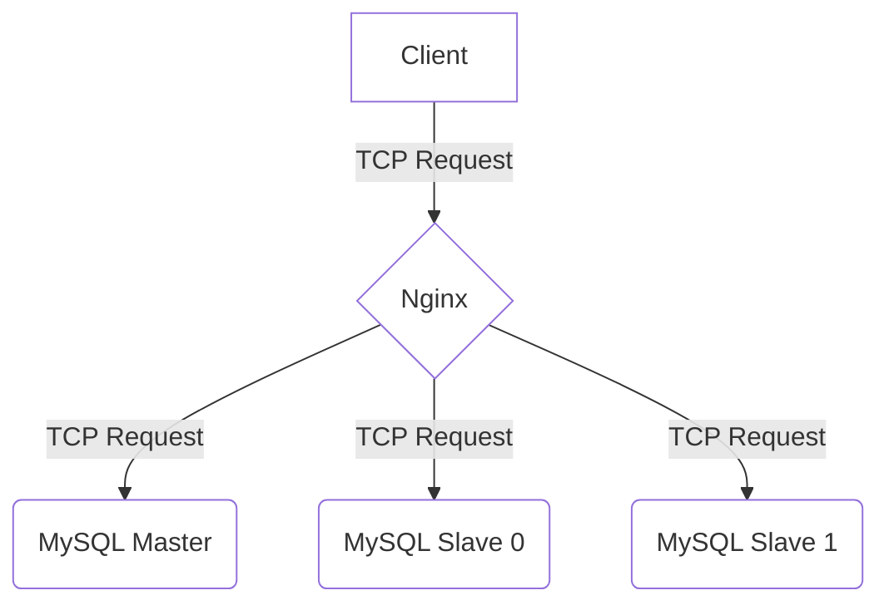

## 引言

在请求量很大的网络应用程序中，我们通常需要部署多个应用实例来缓解应用的工作负载，然后用负载均衡器（硬件或者软件）将请求流量按照特定的负载均衡算法转发到不同的实例。这篇文章是使用 NGINX 作为 MySQL 的 TCP 负载均衡器的实践。

使用负载均衡器的好处：

1.  对数据库进行负载均衡，避免数据库过载。
2.  应用程序可以使用同样的 IP 或者主机名访问集群中的所有数据库。
3.  如果一个节点崩溃，可以绕过该节点并保持应用持续运行。
4.  横向扩展比纵向扩展更简单

## 配置读写分离

为了演示如何使用Nginx配置MySQL主从架构下的读写分离，我将使用 Docker Compose 在 Linux 系统中启动3个 MySQL 实例（1个主节点和2个从节点）和1个 NGINX 实例，将读请求分发到MySQL的主节点和从节点，将写请求分发到MySQL主节点实例。



Docker Compose 启动文件 `docker-compose.yml` 如下：

```html
version: '3.8'

networks:
  nginx_mariadb:

services:
  load_balancer:
    image: nginx:stable-alpine
    container_name: nginx-load-balancer
    ports:
      - "3306:3306"
      - "33060:33060"
    volumes:
      - ./nginx/nginx.conf:/etc/nginx/nginx.conf
    networks:
      - nginx_mariadb

  mariadb-master:
    image: 'bitnami/mariadb:latest'
    hostname: "master.janwee.ubuntu"
    container_name: mariadb_master
    volumes:
      - ./mariadb:/var/lib/mysql
    restart: unless-stopped
    tty: true
    environment:
      MARIADB_REPLICATION_MODE: master
      MARIADB_DATABASE: nerddb
      MARIADB_USER: janwee
      MARIADB_PASSWORD: janwee
      MARIADB_ROOT_PASSWORD: janwee
      MARIADB_REPLICATION_USER: rplusr
      MARIADB_REPLICATION_PASSWORD: janwee
    networks:
      - nginx_mariadb

  mariadb-slave0:
    image: 'bitnami/mariadb:latest'
    hostname: "slave0.janwee.ubuntu"
    container_name: mariadb-slave0
    restart: unless-stopped
    tty: true
    environment:
      MARIADB_REPLICATION_MODE: slave
      MARIADB_REPLICATION_USER: rplusr
      MARIADB_REPLICATION_PASSWORD: janwee
      MARIADB_MASTER_HOST: "master.janwee.ubuntu"
      MARIADB_MASTER_PORT_NUMBER: 3306
      MARIADB_MASTER_ROOT_PASSWORD: janwee
    networks:
      - nginx_mariadb

  mariadb-slave1:
    image: 'bitnami/mariadb:latest'
    hostname: "slave1.janwee.ubuntu"
    container_name: mariadb-slave1
    restart: unless-stopped
    tty: true
    environment:
      MARIADB_REPLICATION_MODE: slave
      MARIADB_REPLICATION_USER: rplusr
      MARIADB_REPLICATION_PASSWORD: janwee
      MARIADB_MASTER_HOST: "master.janwee.ubuntu"
      MARIADB_MASTER_PORT_NUMBER: 3306
      MARIADB_MASTER_ROOT_PASSWORD: janwee
    networks:
      - nginx_mariadb
```

这里使用 bitnami 的镜像是因为更容易部署 MySQL 主从复制架构。主节点的主机名是 `master.janwee.ubuntu`,两个从节点的主机名是 `slave0.janwee.ubuntu`和`slave1.janwee.ubuntu`。将所有MySQL节点和Nginx节点都放在同一个网络下，在 NGINX 负载均衡器中暴露 `3306` 和 `33060` 端口。

NGINX 节点中的 `volumes` 选项将配置文件 `nginx/nginx.conf` 挂载到容器内部：

```html
worker_processes 1;

# Configuration of connection processing
events {
    worker_connections 1024;
}

# Configuration specific to TCP/UDP and affecting all virtual servers
stream {
    log_format log_stream '$remote_addr - [$time_local] $protocol $status $bytes_sent $bytes_received $session_time "$upstream_addr"';
    access_log /var/log/nginx/mysql.log log_stream;

    upstream read {
        server master.janwee.ubuntu:3306;
        server slave0.janwee.ubuntu:3306;
        server slave1.janwee.ubuntu:3306;
    }

    # Configuration of a TCP virtual server
    server {
        listen 3306;
        proxy_pass read;
        proxy_connect_timeout 1s;
        error_log /var/log/nginx/mysql_error.log;
    }

    upstream write {
        server master.janwee.ubuntu:3306;
    }

    server {
        listen 33060;
        proxy_pass write;
        proxy_connect_timeout 1s;
        error_log /var/log/nginx/mysql_error.log;
    }
}
```

这里设置了两个输入流：`read` 和 `write`。`read` 同时指向主节点和两个从节点，`write` 指向主节点。

然后将 nginx 主机名 `janwee.ubuntu` 加入本地 DNS 配置文件 `/etc/hosts`中，在 Linux 终端中使用如下命令：

```text
echo "127.0.0.1 janwee.ubuntu" >> /etc/hosts
```

在 `docker-compose.yml` 所在目录下运行如下命令启动容器组：

```text
docker compose up -d
```

测试连接到 `3306` 端口并使用 `SELECT @@hostname;` 查询当前主机名：

```bash
$ mysql -h janwee.ubuntu -P 3306 -u root -pjanwee -e "select @@hostname";
+---------------------+
| @@hostname          |
+---------------------+
| master.janwee.ubuntu |
+---------------------+

$ mysql -h janwee.ubuntu -P 3306 -u root -pjanwee -e "select @@hostname";
+----------------------+
| @@hostname           |
+----------------------+
| slave0.janwee.ubuntu |
+----------------------+

$ mysql -h janwee.ubuntu -P 3306 -u root -pjanwee -e "select @@hostname";
+----------------------+
| @@hostname           |
+----------------------+
| slave1.janwee.ubuntu |
+----------------------+
```

测试连接到 `33060` 端口并使用 `SELECT @@hostname;` 查询当前主机名：

```bash
$ mysql -h janwee.ubuntu -P 33060 -u root -pjanwee -e "select @@hostname";
+---------------------+
| @@hostname          |
+---------------------+
| master.janwee.ubuntu |
+---------------------+

$ mysql -h janwee.ubuntu -P 33060 -u root -pjanwee -e "select @@hostname";
+----------------------+
| @@hostname           |
+----------------------+
| master.janwee.ubuntu |
+----------------------+

$ mysql -h janwee.ubuntu -P 33060 -u root -pjanwee -e "select @@hostname";
+----------------------+
| @@hostname           |
+----------------------+
| master.janwee.ubuntu |
+----------------------+
```

测试结果表明，当连接 `3306` 端口时 NGINX 会在主节点和从节点之间变更，而连接 `33060` 时只会连接到主节点。

## 使用不同的Nginx负载均衡策略

Nginx支持轮循、最少连接数、IP哈希、通用Hash、最少响应时间、随机、权重等多种负载均衡策略。

可以参考 [Nginx TCP和UDP开发者文档](https://docs.nginx.com/nginx/admin-guide/load-balancer/tcp-udp-load-balancer/) 配置不同的负载均衡算法。

完整的代码和文件可以在 [我的GitHub项目](https://github.com/janwee-sha/nginx-mariadb) 上查看。

## 引用 & 资源

1.  Nginx TCP 和 UDP 负载均衡开发者文档 @ [https://docs.nginx.com/nginx/admin-guide/load-balancer/tcp-udp-load-balancer/](https://docs.nginx.com/nginx/admin-guide/load-balancer/tcp-udp-load-balancer/)
2.  Demo项目源码 GitHub 仓库 @ [https://github.com/janwee-sha/nginx-mariadb](https://github.com/janwee-sha/nginx-mariadb)

> [!NOTE]
> 亚洲铜，亚洲铜
>
> 祖父死在这里，父亲死在这里，我也将死在这里
>
> 你是唯一的一块埋人的地方
